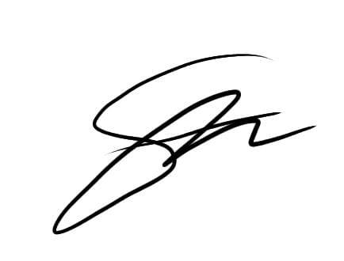
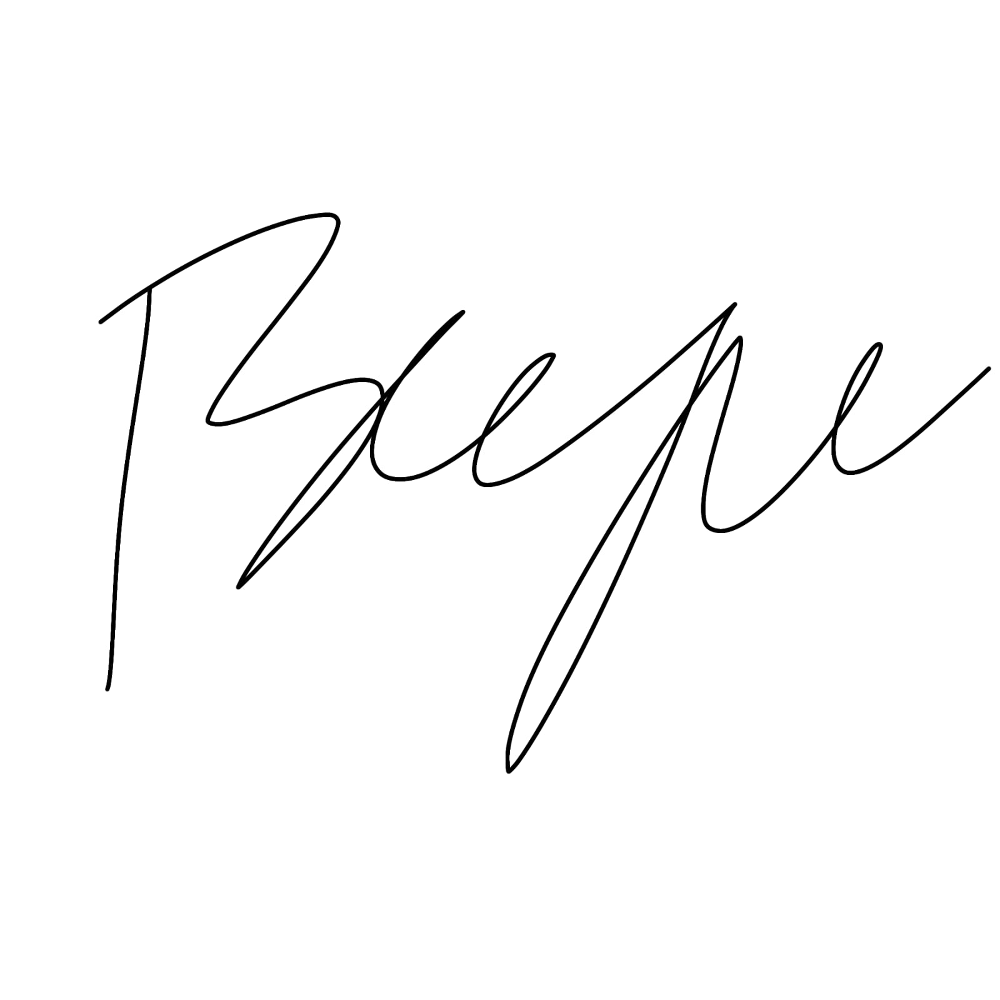
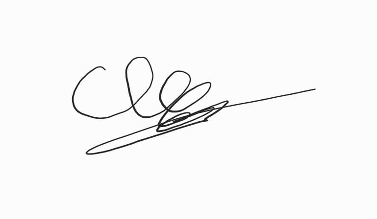
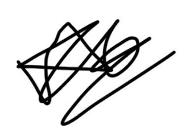
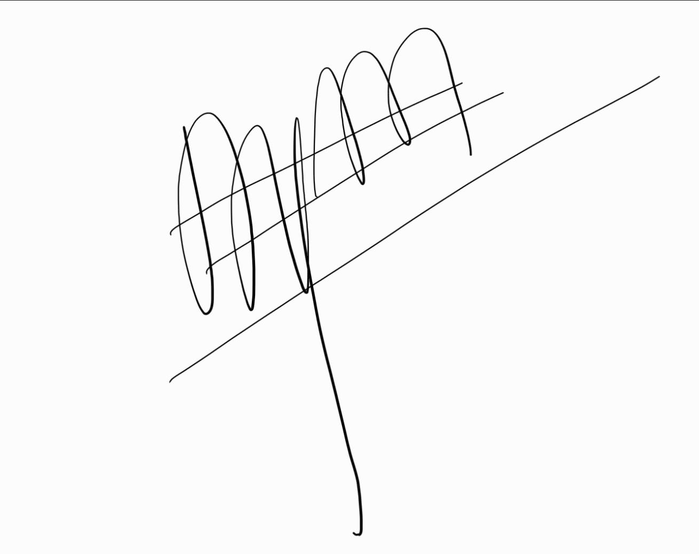

# Deklarasi Penggunaan AI

## Tugas Besar IF2150 - Rekayasa Perangkat Lunak

| Informasi | Keterangan |
|---|---|
| Kelas | 01 |
| Nomor Kelompok | 10 |
| Nama Kelompok | Ducklings |
| Nama Perangkat Lunak | *antri.in* |

**Anggota Kelompok:**

| NIM | Nama |
|---|---|
| 13525145 | Muhammad Nur Fikri Hariyawan |
| 13525085 | Bayu Palamarta Wirawan |
| 13525133 | Chatima Anandakhorita |
| 13525148 | Athallah Nanda Andita |
| 13525091 | Muhammad Fauzi Muharam |

---

### Daftar Isi
* [Milestone 1](#milestone-1)
* Notes: Copy bagian Daftar Isi seperti Milestone 1 untuk Milestone berikutnya, contoh ``* [Milestone 2](#milestone-2)``. Ketika Daftar isi diklik maka akan langsung diarahkan ke bagian bawah sesuai dengan Milestone tujuan.

---

### Log Penggunaan AI per Milestone

Silakan catat penggunaan AI yang berdampak signifikan pada pengerjaan tugas (misal: *generate* fungsi algoritma yang kompleks, *generate* draf dokumen SKPL/DPPL, atau *debugging* error utama). 
*Penggunaan sepele seperti memperbaiki *typo* atau auto-complete satu baris kode tidak perlu dicatat.*

### Milestone 1
| Tool AI | Tujuan Penggunaan | Contoh Prompt Utama | Modifikasi & Validasi Manusia |
| :--- | :--- | :--- | :--- |
| *Gemini* | *Mencari tahu cara menuangkan data di laporan* | *"Katanya boleh pakai curhatan warga X, gimana cara bikin album twit tertentu"* | *AI menyarankan untuk menyajikan data dalam tabel. saya terima saran dari AI dan saya sesuaikan dengan data saya.* |
| | | | | |

### Milestone 2
| Tool AI | Tujuan Penggunaan | Contoh Prompt Utama | Modifikasi & Validasi Manusia |
| :--- | :--- | :--- | :--- |
| | | | | |
| | | | | |

---
### Pernyataan Integritas dan Persetujuan

Kami yang bertanda tangan di bawah ini menyatakan bahwa seluruh log penggunaan AI di atas adalah benar. Kami telah memvalidasi seluruh hasil AI dan bertanggung jawab penuh atas orisinalitas, keamanan, dan kebenaran hasil akhir dari tugas ini.

| Tanda Tangan | Nama Anggota |
| :---: | :--- |
|  | **[13525145 - Muhammad Nur Fikri Hariyawan]** |
|  | **[13525085 - Bayu Palamarta Wirawan]** |
|  | **[13525133 - Chatima Anandakhorita]** |
|  | **[13525148 - Athallah Nanda Andita]** |
|  | **[13525091 - Muhammad Fauzi Muharam]** |
