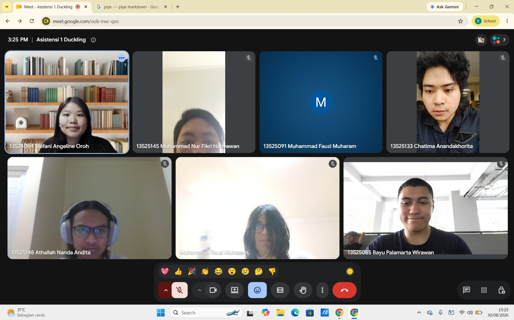

# Form Asistensi

## Tugas Besar IF2150 - Rekayasa Perangkat Lunak

| Informasi | Keterangan |
| --- | --- |
| **Hari** | Minggu |
| **Tanggal** | 30-08-2026 |
| **Kelas** | 01 |
| **Nomor Kelompok** | 10 |
| **Nama Kelompok** | Ducklings  |
| **Nama Perangkat Lunak** | antri.in  |
| **Dokumen** | K01_G10_Form-Asistensi.md  |

### Anggota Kelompok

| NIM | Nama |
| --- | --- |
| 13525145 | Muhammad Nur Fikri Hariyawan |
| 13525085 | Bayu Palamarta Wirawan |
| 13525133 | Chatima Anandakhorita |
| 13525148 | Athallah Nanda Andita |
| 13525091 | Muhammad Fauzi Muharam |

### Catatan

| Catatan |
| --- |
| 1. Perlu ditambahkan data pendukung yang jelas untuk memperkuat alasan pembuatan perangkat lunak.  |
| 2. Rapikan format draft secara keseluruhan terutama bagian analisis kondisi agar lebih terstruktur dan mudah dibaca. |
| 3. Kelompokkan asumsi dan batasan ke dalam kategori pengguna dan teknis, kemudian batasan hukum, sumber daya, dan ruang lingkup. |
| 4. Gunakan nomor urut biasa berdasarkan aktivitas untuk setiap ID User Story, bukan berdasarkan aktor. |
| 5. Pastikan fitur atau solusi yang diajukan menjawab seluruh masalah yang dibahas. |
| 6. Buat diagram proses bisnis secara terpisah untuk setiap alur aktivitas. |

**Notes for this section:**  
*Catatan dapat dituliskan dalam bentuk paragraf atau poin-poin, disesuaikan saja.* 

## Dokumentasi

<!--  -->

  

  <i>Gambar 1. Dokumentasi kegiatan asistensi.</i>

