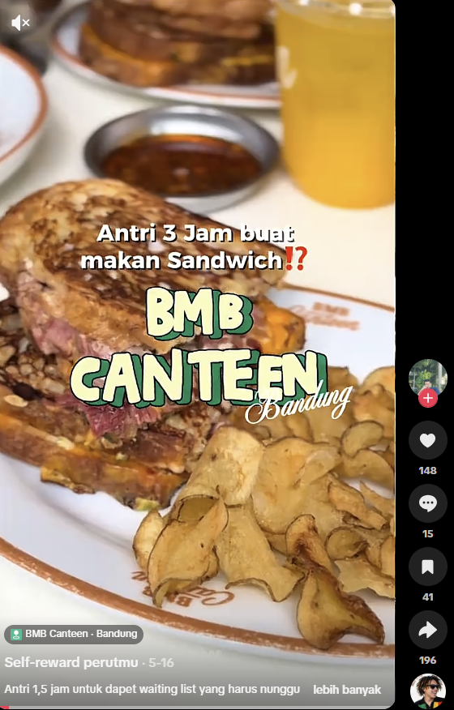
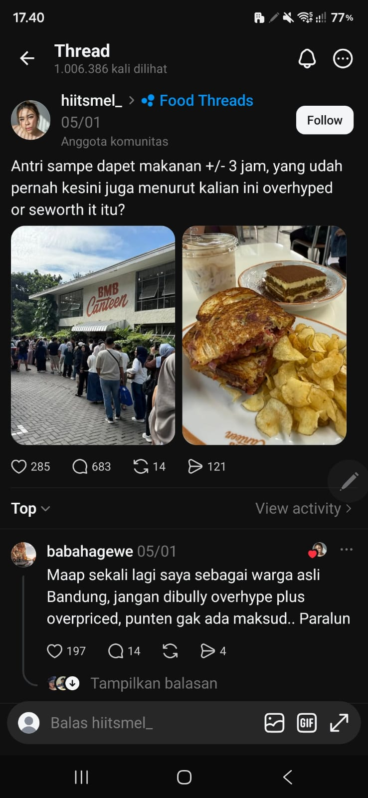
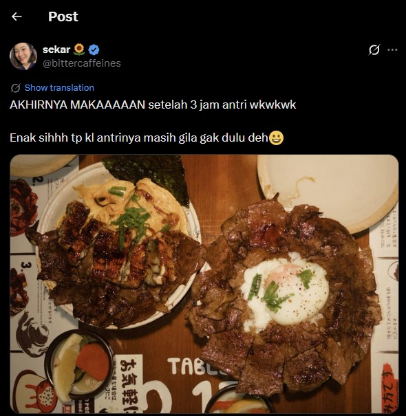
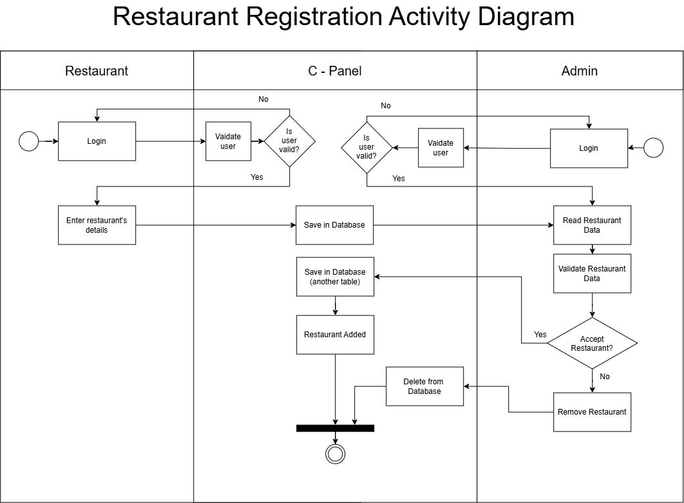
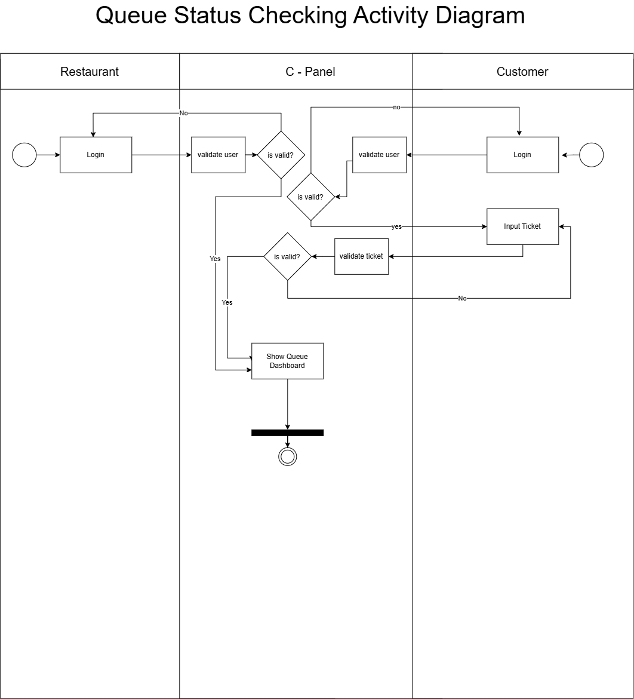
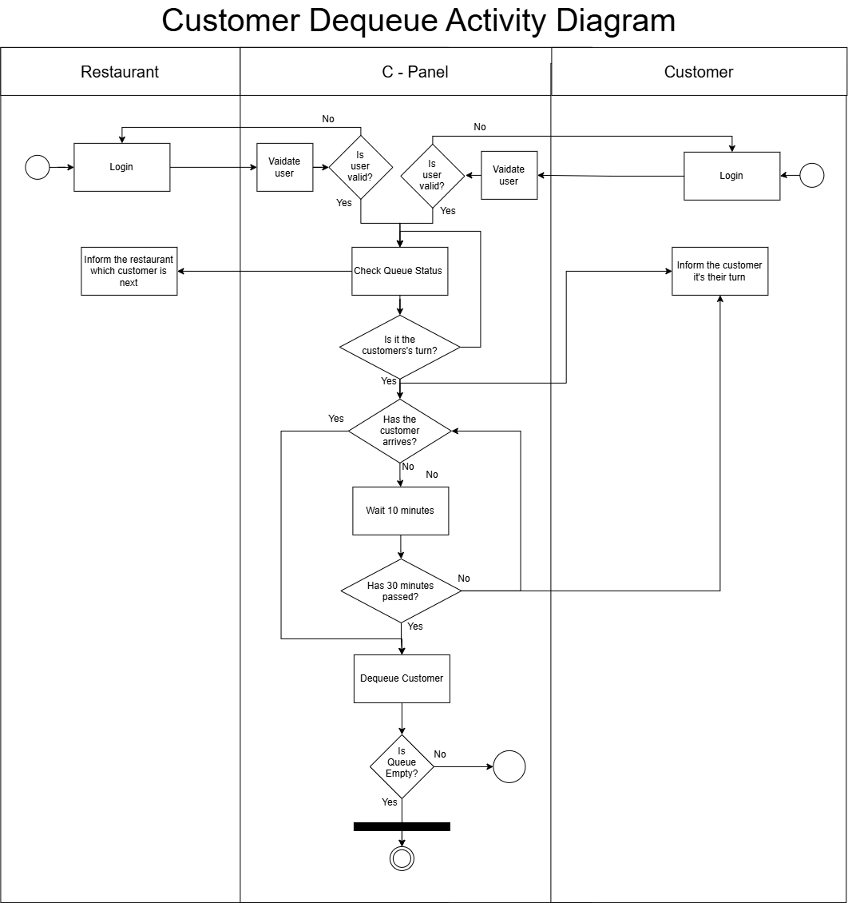

<h1>
IF2150 REKAYASA PERANGKAT LUNAK
 
TUGAS 1
 
TOPIC BRAINSTORMING
</h1>
 

## *antri.in*

### Untuk: Angel

Dipersiapkan oleh:
| Informasi | Keterangan |
| --- | --- |
| Kelas | 01 |
| Kelompok | 10  |

| NIM | Nama |
|---|---|
| 13525145 | Muhammad Nur Fikri Hariyawan |
| 13525085 | Bayu Palamarta Wirawan |
| 13525133 | Chatima Anandakhorita |
| 13525148 | Athallah Nanda Andita |
| 13525091 | Muhammad Fauzi Muharam |
---

 
 

# BAB 1: Analisis Permasalahan

## 1.1 Latar Belakang Masalah
Akhir-akhir ini, industri Food and Business (F&B) digemparkan dengan fenomena "makanan viral Bandung" yang memicu lonjakan konsumen secara instan dan masif yang disebabkan oleh dorongan algoritma media sosial seperti TikTok, Instagram, dan X. Sayangnya, lonjakan konsumen ini tidak diimbangi oleh kesiapan kapasitas operasional dan manajemen antrean dari pihak merchant.

Ketidaksiapan sistemik ini menyebabkan panjang antrean yang tidak wajar. Bahkan, berdasarkan pengamatan fenomena "kuliner viral Bandung" di beberapa platform media sosial, mayoritas konsumen menghabiskan waktu sekitar 1,5 sampai 3 jam hanya untuk mengantri membeli makan.

#### Lampiran Bukti Data

| | |
| :---: | :---: |
|  |  |
| *Gambar 1.1: Keluhan antre 3 jam.* | *Gambar 1.2: Keluhan antre 3 jam.* |
|  |  |
| *Gambar 1.3: Keluhan kehabisan stok setelah mengantre lama.* | *Gambar 1.4: Keluhan inefisiensi alur pemesanan di kasir.* |

Permasalahan ini berakar dari minimnya infrastruktur teknologi manajemen layanan antre pada sektor UMKM kuliner. Oleh karena itu, pengembangan perangkat lunak antri.in dirancang secara spesifik berlandaskan Tujuan Pembangunan Berkelanjutan / Sustainable Development Goals (SDGs) 9: Industri, Inovasi, dan Infrastruktur, khususnya:

* **Modernisasi Infrastruktur Industri F&B**: Meningkatkan efisiensi dan kapasitas operasional UMKM kuliner mikro-menengah melalui adopsi teknologi digital yang ramah pengguna. antri.in memodernisasi infrastruktur manajemen layanan fisik konvensional menjadi infrastruktur berbasis digital.

* **Aksesibilitas Teknologi Informasi dan Komunikasi**: Menyediakan solusi platform digital yang inklusif, terjangkau, dan mudah diakses baik oleh pemilik merchant F&B skala kecil maupun masyarakat luas melalui peranti seluler (mobile-web).

Krisis antrean makanan viral bukan lagi sebatas fenomena dinamika tren gaya hidup, melainkan bentuk kegagalan sistem manajemen rantai layanan (service supply chain failure). Software antri.in hadir sebagai bentuk inovasi infrastruktur perangkat lunak yang mendesak untuk mengubah antrean fisik  menjadi sistem manajemen antrean terorganisasi secara real-time. Langkah ini penting demi memperjuangkan waktu konsumen yang berharga dan mengoptimalkan daya tampung operasional UMKM tanpa memerlukan perluasan area fisik kedai.

## 1.2 Analisis Kondisi Saat Ini
###  1.2.1 Sistem Antrean Konvensional / Fisik (Sistem Manual)
**Mekanisme:**  
  Konsumen datang langsung ke lokasi *merchant*, mengambil kertas nomor antrean, dan menunggu namanya dipanggil melalui pengeras suara atau panggilan verbal.

**Kelemahan & Celah:**
  * **Terikat Lokasi:** Konsumen tidak berani meninggalkan area kedai karena risiko nomor antreannya terlewati.
  * **Ketiadaan Transparansi:** Tidak ada visualisasi atau perhitungan otomatis mengenai berapa lama durasi pemrosesan tiap pesanan secara akurat.
  * **Kemacetan di Kasir:** Proses penentuan menu dan pembayaran baru terjadi di kasir, memakan waktu 2–5 menit per transaksi yang terakumulasi menjadi jam penungguan.

### 1.2.2 Platform Pesan-Antar (GoFood, GrabFood, ShopeeFood)
**Mekanisme:**  
  Sistem dirancang khusus untuk pemesanan jarak jauh dengan pengantaran oleh kurir atau pengambilan cepat (*pick-up*).

**Kelemahan & Celah pada Fenomena Makanan Viral:**
  * **Orientasi Pengantaran:** Platform *e-commerce* tidak dibekali mekanisme untuk mengantarkan dan mengontrol kedatangan konsumen yang ingin makan di tempat atau membeli langsung secara teratur.
  * **Ketidakmampuan Mengontrol Waktu:** Platform-Platform ini hanya menyediakan opsi toko "Buka" atau "Tutup". Tidak ada pembatasan jumlah transaksi berdasarkan kuota per rentang waktu (misal: maksimum 20 transaksi per 15 menit). Akibatnya, ketika pesanan online membludak bersamaan dengan kedatangan konsumen fisik, dapur merchant mengalami kemacetan total.
### 1.2.3 Perbandingan kondisi saat ini dengan antri.in 
| Parameter Evaluasi                | Sistem Fisik Konvensional               | Platform On-Demand Saat Ini             | Perangkat Lunak Solusi (antri.in)                             |
| :-------------------------------- | :-------------------------------------- | :-------------------------------------- | :------------------------------------------------------------ |
| **Lokasi Pemantauan**             | Wajib berada di lokasi merchant         | Aplikasi pemesanan antar                | Bebas memantau dari mana saja secara real-time                |
| **Kontrol Kedatangan**            | Massa menumpuk sekaligus| Tanpa pembatasan slot waktu kedatangan  | Pengaturan Slot Waktu Kedatangan           |
| **Proses Pemesanan & Pembayaran** | Dilakukan langsung di kasir| Sebelum makanan dibuat       | Pemesanan & Pembayaran di Muka|
| **Sistem Pembaruan Antrean**      | Panggilan suara / Papan manual          | Status kurir jalan                      | Sistem Antrean Virtual Real-Time          |

### 1.2.4 Urgensi antri.in
Berdasarkan analisis kesenjangan di atas, celah utama yang belum terselesaikan adalah ketiadaan integrasi antara Pemantauan Antrean Digital Real-Time (Virtual Live Queueing), Pengaturan Slot Waktu (Time-Slot Scheduling), dan Pemesanan & Pembayaran Awal (Pre-ordering & Pre-payment).

Perangkat lunak antri.in dirancang untuk menyelesaikan kesenjangan tersebut dengan menghapus waktu berpikir di depan kasir melalui pemesanan awal, meratakan kurva kedatangan massa (flattening the queue curve) berbasis kuota jam, serta memberikan kebebasan mobilitas bagi konsumen selama masa penungguan antrean.

---
# BAB 2: Analisis Solusi

## 2.1 Deskripsi Perangkat Lunak
Perangkat lunak yang akan kami kembangkan merupakan sistem pemesanan makanan viral dengan antrean digital berbasis web yang bertujuan agar pengguna tidak perlu mengantri secara langsung pada restoran. Sistem ini memungkinkan pengguna untuk mencari restoran makanan viral, melihat informasi makanan dan restoran, melakukan pemesanan, memantau antrean dan estimasi pesanan akan selesai, serta fitur booking tempat jika pengguna memutuskan untuk dine-in. Cara kerja dari aplikasi berbasis web ini adalah pertama pengguna memilih restoran yang tersedia, kemudian pengguna dapat membaca informasi mengenai makanan yang terdapat di restoran tersebut. Jika sudah, pengguna dapat memilih makanan yang akan dibeli dan lanjut ke proses pembayaran. Pembayaran dilakukan menggunakan qris, ketika pengguna sudah membayar, barulah akan mendapatkan nomor antrian dan estimasi pesanan selesai sehingga pengguna dapat memperkirakan waktu kedatangan.

Platform yang kami pilih adalah web-based application sehingga dapat diakses dengan mudah menggunakan segala jenis perangkat seperti smartphone, tablet, laptop, atau komputer. Platform web dipilih karena memberikan kemudahan akses pada pengguna tanpa harus melakukan download aplikasi tambahan, pengguna hanya perlu membuat akun dengan menggunakan email atau hanya menuliskan nama saja.

Nilai unik dari aplikasi antrean online milik kami di banding dengan aplikasi lain yang serupa adalah kami memiliki sistem live kuota meja yang tersedia ketika pengguna memutuskan untuk makan di tempat. Selain itu, agar terorganisir dengan baik, kami memisah antrean untuk pengguna takeaway dan pengguna dine-in. Jika kuota meja untuk dine-in sedang penuh, maka antrean untuk dine-in akan dibatasi agar pengguna tidak menunggu terlalu lama.

## 2.2 Asumsi dan Batasan
1. Asumsi Pengguna

- Pengguna memiliki perangkat smartphone dengan spesifikasi penyimpanan yang bervariasi, telah terpasang peramban web modern (Google Chrome, Safari, Mozilla Firefox, dll.), serta memiliki akses koneksi internet aktif.

- Pengguna memahami dan bersedia mematuhi estimasi waktu kedatangan yang diperoleh saat melakukan pemesanan nomor antrean melalui platform web.

2. Asumsi Teknis

- Pengelola restoran menyediakan minimal satu perangkat operasional (smartphone, tablet, atau laptop) dengan koneksi internet yang stabil untuk mengelola dan memproses antrean secara real-time.

- Pengelola restoran telah menentukan parameter kapasitas batas antrean/pesanan yang dapat ditangani berdasarkan ketersediaan bahan baku dan kapasitas tenaga kerja operasional.

3. Batasan Hukum dan Regulasi

- Sistem wajib mematuhi ketentuan Undang-Undang Nomor 27 Tahun 2022 tentang Pelindungan Data Pribadi (UU PDP) dalam hal pemrosesan, penyimpanan, dan pengelolaan data pengguna.

- Pemrosesan transaksi pembayaran digital tunduk sepenuhnya pada regulasi Bank Indonesia terkait standar operasional dan keamanan transaksi QRIS.

4. Batasan Sumber Daya

- Cakupan sistem terbatas pada penerimaan pesanan secara digital melalui aplikasi web, tanpa integrasi langsung ke mesin pencetak struk fisik.

- Kapasitas infrastruktur server bersifat terbatas, sehingga performa sistem dapat terpengaruh saat terjadi lonjakan akses (peak traffic) yang melebihi kuota beban server.

5. Batasan Lingkup Solusi
- Sistem memverifikasi status transaksi secara real-time.

- Fitur pembayaran dibatasi pada metode Dynamic QRIS pada antarmuka web untuk mencegah ketidaksesuaian nominal transaksi yang diinput oleh pengguna.

---

# BAB 3: Spesifikasi Kebutuhan dan Proses Bisnis

## 3.1 Identifikasi Aktor
Buatlah daftar seluruh aktor (pengguna) yang akan berinteraksi langsung dengan sistem solusi yang kalian kembangkan. Berikan penjelasan singkat mengenai peran dan karakteristik dari masing-masing aktor tersebut.

| Aktor | Deskripsi |
| :--- | :--- |
| *Restoran* | *Pengguna ini bertindak sebagai pihak yang mendaftarkan diri dalam daftar restoran viral, menerima informasi pelanggan yang akan datang, dan urutan antrian atau kedatangan pelanggan. Karakteristik dari pengguna ini adalah mengutamakan keakuratan informasi dan pengendalian kedatangan pelanggan* |
| *Pelanggan* | *Pengguna ini bertindak sebagai pihak yang mencari salah satu restoran yang viral dan melakukan booking di restoran tersebut. Karakteristik dari pengguna ini adalah mengutamakan kecepatan booking dan kepastian waktu setelah booking.* |
| *Admin* | *Pengguna ini bertindak sebagai pihak yang bertanggung jawab dalam memasukan restoran dalam daftar restoran. Karakteristik dari pengguna ini adalah mengutamakan keakuratan dan ketelitian dalam memperhatikan restoran-restoran yang mendaftar dalam website.* |

## 3.2 Kebutuhan Pengguna Awal
Definisikan apa yang ingin dicapai oleh pengguna saat menggunakan sistem ini dalam format *User Story* (Sebagai [Aktor], saya ingin [Aktivitas/Kebutuhan], sehingga [Tujuan/Nilai]). Pastikan kalian berfokus pada "apa yang ingin dilakukan pengguna".

| ID | Aktor | Kebutuhan / Aktivitas | Tujuan / Nilai |
| :--- | :--- | :--- | :--- |
| US-01 | *Restoran* |  *Mendaftarkan restoran dalam daftar restoran viral* | *Bisa ditemukan oleh pelanggan* |
| US-02 | *Restoran* | *Mendapatkan nomor antrian saat ini dan daftar pelanggan* | *Bisa mengetahui urutan antrian dan mengatur penempatan pelanggan lebih cepat* |
| US-03 | *Pelanggan* | *Mencari daftar restoran viral* | *Bisa menemukan restoran dan masuk dalam antrian* |
| US-04 | *Pelanggan* | *Melakukan booking dalam restoran* | *Masuk dalam antrian dan mendapatkan nomor antrian* |
| US-05 | *Pelanggan* | *Melihat status antrian* | *Mengetahui kapan waktu untuk ke restoran viral untuk makan sesuai antrian* |
| US-06 | *Admin* | *Memeriksa data restoran yang mendaftar* | *Tidak ada restoran palsu yang memasuki website* |
| US-07 | *Admin* | *Menambahkan restoran dalam daftar restoran viral* | *Restoran bisa dicari oleh pelanggan* |

## 3.3 Model Proses Bisnis
Buatlah *Activity Diagram* atau *Swimlane Diagram* yang menunjukkan alur kerja proses bisnis dari sistem solusi. Diagram ini harus memvisualisasikan bagaimana alur operasional di dunia nyata berjalan lebih efisien dengan adanya interaksi antara aktor (yang didefinisikan pada poin 3.1) dan sistem perangkat lunak. Perhatikan notasi yang digunakan dalam pembuatannya.
 

<i>Gambar 1. Restaurant Registration Diagram</i>

<i>Gambar 2. Costumer Booking Diagram</i>

<i>Gambar 3. Queue Status Checking Diagram</i>

<i>Gambar 4. Customer Dequeue Diagram</i>

 

# Referensi
- Diagram UML: https://www.drawio.com/, https://staruml.io/
