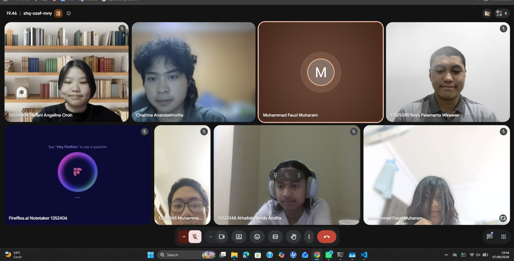

# Form Asistensi

## Tugas Besar IF2150 - Rekayasa Perangkat Lunak

| Informasi | Keterangan |
| --- | --- |
| **Hari** | Senin |
| **Tanggal** | 07/09/2026 |
| **Kelas** | 01 |
| **Nomor Kelompok** | 10 |
| **Nama Kelompok** | Ducklings  |
| **Nama Perangkat Lunak** | Antri.in  |
| **Dokumen** | K01_G10_RG |

### Anggota Kelompok

| NIM | Nama |
| --- | --- |
| 13525145 | Muhammad Nur Fikri Hariyawan |
| 13525085 | Bayu Palamarta Wirawan |
| 13525133 | Chatima Anandakhorita |
| 13525148 | Athallah Nanda Andita |
| 13525091 | Muhammad Fauzi Muharam |

### Catatan

| Catatan |
| --- |
| 1. Pembayaran dapat dilakukan sebelum masuk antrian dalam pre-order  |
| 2. selain menggunakan QRIS sebagai alat transaksi, bisa menggunakan Virtual Account seperti Dana |
| 3. Backup database untuk mengatasi server down saat sedang pick-hour dan menggunakan konsep visibility status dari frontend |
| 4. Pada perangkat lunak ini menggunakan web HP, dikarenakan lebih nyaman untuk memesan/mem-booking di mana saja dan kapan saja |
| 5. Menampilkan informasi penting seperti, rating resto, sneak peak resto, review resto. |
| 6. Semakin dekat memesan tempat dengan hari yang dituju, semakin besar pula fee-nya |
| 7. Fitur booking dari jauh hari tergantung dari restorannya |
| 8. Kuota restoran ditentukan oleh restoran dan dapat diupdate kapan saja |
| 9. Queue dapat di dequeue oleh restoran |
| 10. Menggunakan konsep EARS pada 2.4 dan 2.5 |
| 11. Pada kategori business biasanya "Tidak", R17 sebagai System, R11 dan R08 bukan sebagai P/L |
| 12. Take away + dine in sebagai business |
| 13. Kebutuhan untuk fitur booking dari jauh hari |
| 14. Antrian harus dapat ditampilkan dan diperbarui dalam waktu cepat (kurang lebih 1 menit) |
| 15. "Tidak bisa double charge (pembayaran konsisten)" merupakan bagian dari KNF  |
| 16. Penyampaian solusi |
| 17. A08 perlu diperbaiki |
| 18. Untuk penjelasan KNF tidak perlu bertele-tele |
| 19. Availability: tambahan |

**Notes for this section:**  
*Catatan dapat dituliskan dalam bentuk paragraf atau poin-poin, disesuaikan saja.* 

## Dokumentasi

<!--  -->

  

  <i>Gambar 1. Dokumentasi kegiatan asistensi.</i>

