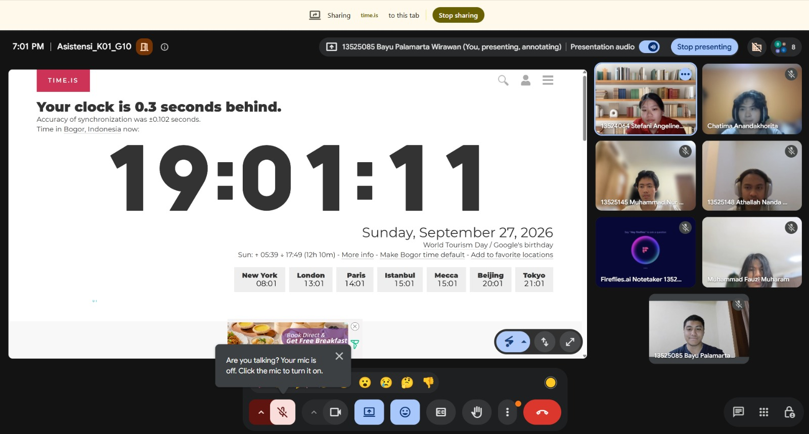

# Form Asistensi

## Tugas Besar IF2150 - Rekayasa Perangkat Lunak

| Informasi | Keterangan |
| --- | --- |
| **Hari** | *Minggu* |
| **Tanggal** | *27/09/2026* |
| **Kelas** | *K01* |
| **Nomor Kelompok** | *G10*  |
| **Nama Kelompok** | *Ducklings*  |
| **Nama Perangkat Lunak** | *antri.in*  |
| **Dokumen** | *K01_G10_SKPL.md*  |

### Anggota Kelompok

| NIM | Nama |
| --- | --- |
| *13525145* | *Muhammad Nur Fikri Hariyawan* |
| *13525085* | *Bayu Palamarta Wirawan* |
| *13525133* | *Chatima Anandakhorita* |
| *13525148* | *Athallah Nanda Andita* |
| *13525091* | *Muhammad Fauzi Muharam* |

### Catatan

| Catatan |
| --- |
| 1. *Cari sumber-sumber untuk referensi*  |
| 2. *Server: Lokal, Client: Lokal, Database: Caritau ada banyak, OS: disarankan Windows, bisa ditambahkan bahasa pemrograman* |
| 3. *Registrasi Login tidak perlu dibuat diagram, diagramnya tidak perlu dibuat baru lagi* |
| 4. *Sebaiknya lebih memperhatikan bagian Bab 4 sampai Bab 6* |

**Notes for this section:**  
*Catatan dapat dituliskan dalam bentuk paragraf atau poin-poin, disesuaikan saja.* 

## Dokumentasi

<!--  -->

  

  <i>Gambar 1. Dokumentasi kegiatan asistensi.</i>

