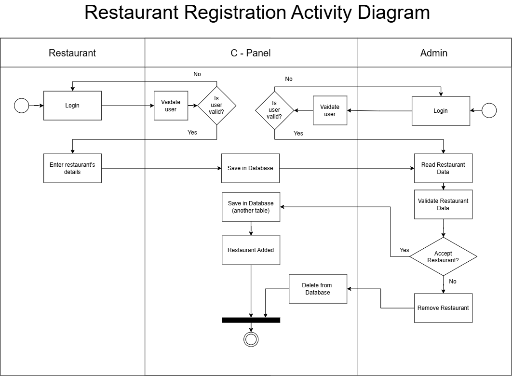
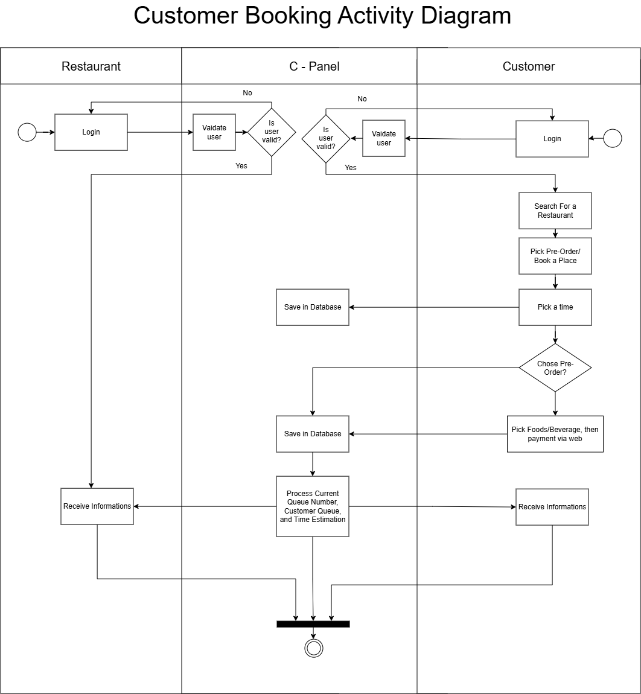
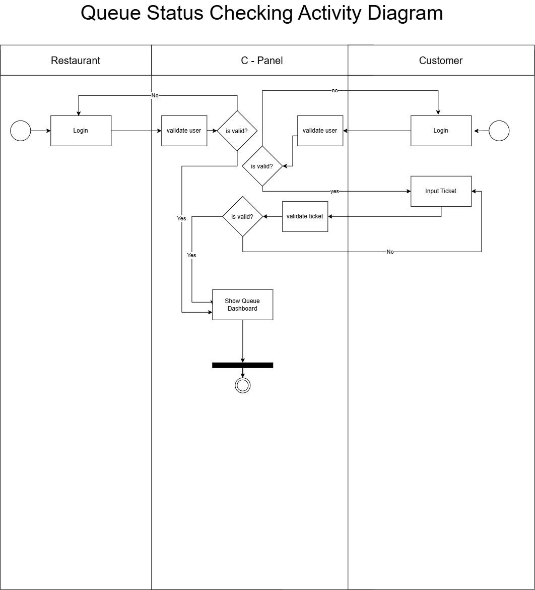
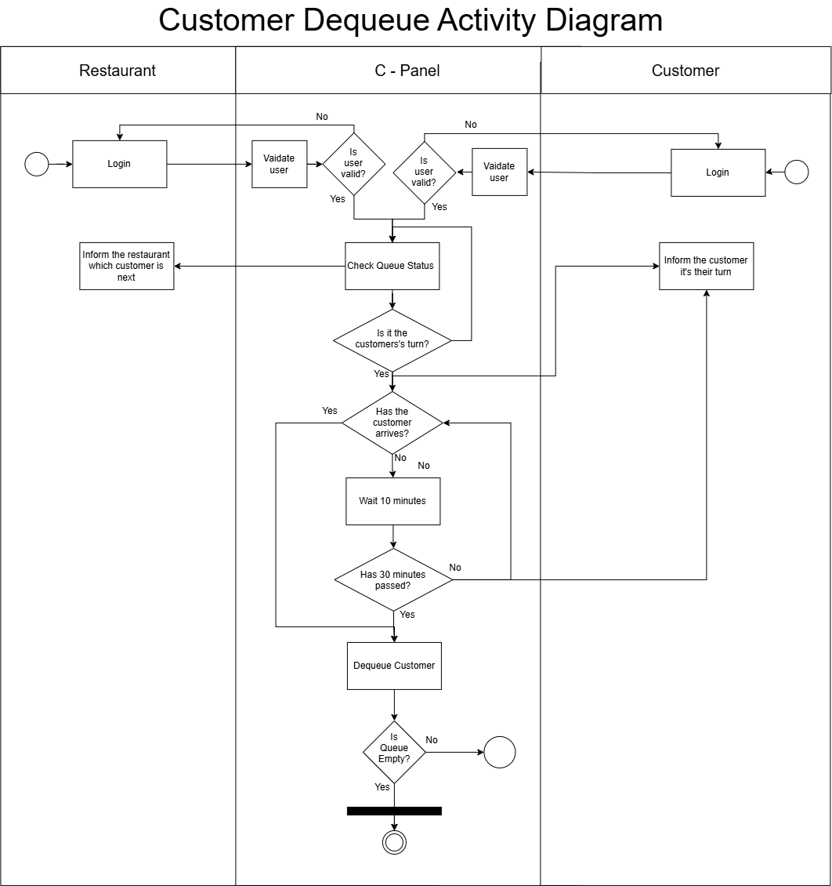
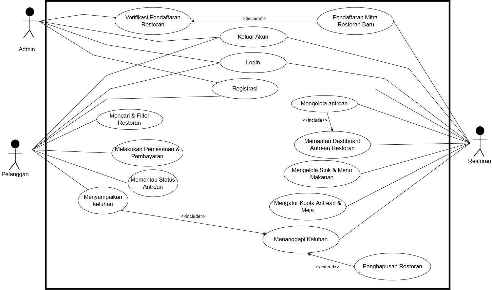
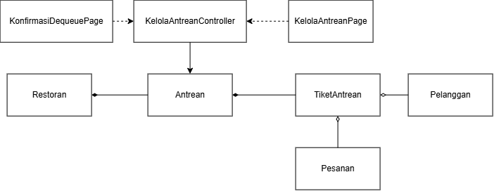
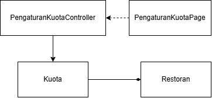
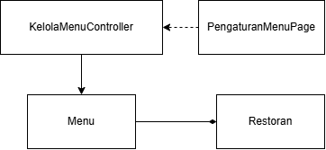
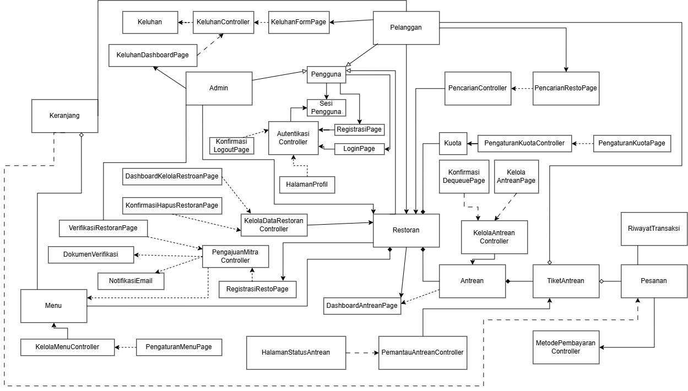

<h1>
IF2150 REKAYASA PERANGKAT LUNAK
 
TUGAS 5
 
SPESIFIKASI KEBUTUHAN PERANGKAT LUNAK (SKPL)
</h1>
 

## antri.in

### Untuk: Angel

Dipersiapkan oleh:
| Informasi | Keterangan |
| --- | --- |
| Kelas | 01 |
| Kelompok | 10 |

| NIM | Nama |
|---|---|
| 13525145 | Muhammad Nur Fikri Hariyawan |
| 13525085 | Bayu Palamarta Wirawan       |
| 13525133 | Chatima Anandakhorita        |
| 13525148 | Athallah Nanda Andita        |
| 13525091 | Muhammad Fauzi Muharam       |
---

## Daftar Perubahan

| Revisi | Deskripsi |
| :--- | :--- |
| *A* | *Deskripsikan perubahan yang dilakukan dari dokumen sebelumnya pada dokumen ini. Jika tidak terdapat perubahan, harap kosongkan tabel.* |
| *B* |  |
| *C* |  |
| ... |  |

 

# BAB 1: Pendahuluan

## 1.1 Tujuan Penulisan Dokumen
Tujuan dokumen ini adalah menjelaskan kebutuhan-kebutuhan dan deskripsi perangkat lunak yang akan dikembangkan oleh kelompok Ducklings bernama antri.in. Dokumen ini akan digunakan oleh kelompok Ducklings, asisten dosen, dan dosen.

## 1.2 Lingkup Masalah
Tuliskan dengan ringkas nama aplikasi dan deskripsi singkatnya. Bagian ini maksimal berisi satu paragraf, dapat diringkas dari BAB 1 *Analisis Permasalahan* pada dokumen *Topic Brainstorming*.

Perangkat lunak bernama antri.in yang akan kami kembangkan merupakan sistem pemesanan makanan viral dengan antrean digital berbasis web yang bertujuan agar pengguna tidak perlu mengantri secara langsung pada restoran. Sistem ini memungkinkan pengguna untuk mencari restoran makanan viral, melihat informasi makanan dan restoran, melakukan pemesanan, memantau antrean dan estimasi pesanan akan selesai, serta fitur booking tempat jika pengguna memutuskan untuk dine-in. Cara kerja dari aplikasi berbasis web ini adalah pertama pengguna memilih restoran yang tersedia, kemudian pengguna dapat membaca informasi mengenai makanan yang terdapat di restoran tersebut. Jika sudah, pengguna dapat memilih makanan yang akan dibeli dan lanjut ke proses pembayaran. Pembayaran dilakukan menggunakan qris, ketika pengguna sudah membayar, barulah akan mendapatkan nomor antrian dan estimasi pesanan selesai sehingga pengguna dapat memperkirakan waktu kedatangan.

## 1.3 Definisi, Istilah, dan Singkatan
Semua definisi dan singkatan yang digunakan dalam dokumen ini beserta penjelasannya.

Tabel 1.3. Definisi Istilah dan Singkatan

| Singkatan, Akronim, atau Istilah | Penjelasan |
| :--- | :--- |
| *P/L* | *Singkatan dari Perangkat Lunak, yaitu aplikasi yang memberikan perintah kepada komputer untuk menjalankan tugas tertentu.* |
| *SKPL* | *Singkatan dari Spesifikasi Kebutuhan Perangkat Lunak, yaitu dokumen yang merangkum kriteria-kriteria yang diperlukan untuk membangun aplikasi menjalankan tugasnya.* |
| *US* | *Singkatan dari User Story.* |
| *A* | *Singkatan dari Aktivitas.* |
| *R* | *Singkatan dari Requirement.* |
| *KF* | *Singkatan dari Kebutuhan Fungsional.* |
| *KNF* | *Singkatan dari Kebutuhan Non-Fungsional.* |
| *UC* | *Singkatan dari Use Case.* |
| *C* | *Singkatan dari Class.* |
| *EARS* | *Easy Approach to Requirements Syntax, yaitu pola penulisan kebutuhan agar konsisten dan mudah diuji.* |
| *AC* | *Singkatan dari Aktor.* |
| *...* | *...* |

## 1.4 Aturan Penomoran
Tuliskan aturan penomoran (ID) yang digunakan dalam dokumen ini. Gunakan pola ID yang **sama** dengan yang sudah dipakai pada dokumen-dokumen sebelumnya, jangan membuat pola baru di dokumen ini.

Tabel 1.4. Aturan Penomoran

| Hal/Bagian | Penomoran | Keterangan |
| :--- | :--- | :--- |
| *User Story* | *USXX* | Mulai dari 01, 02, dan seterusnya |
| *Kebutuhan Fungsional* | *KFXX* | Mulai dari 01, 02, dan seterusnya |
| *Kebutuhan Non-Fungsional* | *KNFXX* | Mulai dari 01, 02, dan seterusnya |
| *Aktivitas* | *AXX* | Mulai dari 01, 02, dan seterusnya |
| *Use Case* | *UCXX* | Mulai dari 01, 02, dan seterusnya |
| *Kelas* | *CXX* | Mulai dari 01, 02, dan seterusnya |
| *Requirement* | *RXX* | Mulai dari 01, 02, dan seterusnya |
| *Aktor* | *ACXX* | Mulai dari 01, 02, dan seterusnya |
| *...* | *...* |

## 1.5 Referensi
Pressman, R. S., _Software Engineering: A Practitioner's Approach_, _8th Edition_, McGraw-Hill, 2015.  
Sommerville, I., _Software Engineering_, _10th Edition_, Pearson, 2016.  
Larman, C., _Applying UML and Patterns: An Introduction to Object-Oriented Analysis and Design and Iterative Development_, _3rd Edition_, Prentice Hall, 2004.

## 1.6 Deskripsi Umum Dokumen (Ikhtisar)
Dokumen ini disusun dalam enam bab. Bab 1 berisi pendahuluan, mencakup tujuan penulisan dokumen, lingkup masalah, definisi dan istilah yang digunakan, aturan penomoran, referensi, serta ikhtisar dokumen ini sendiri. Bab 2 membahas deskripsi umum perangkat lunak antri.in yang meliputi gambaran proses bisnis, deskripsi umum sistem, pengguna beserta kebutuhannya, batasan perangkat lunak, dan lingkungan operasi yang dibutuhkan. Bab 3 memuat deskripsi kebutuhan perangkat lunak secara rinci, yaitu Kebutuhan Fungsional (KF) dalam format EARS dan Kebutuhan Non-Fungsional (KNF). Bab 4 menjelaskan pemodelan use case, mencakup identifikasi aktor, identifikasi use case, use case diagram, dan skenario dari setiap use case. BAB 5 menjabarkan pemodelan kelas yang terdiri atas identifikasi kelas, diagram kelas per use case, dan diagram kelas keseluruhan. Terakhir, BAB 6 berisi traceability yang memetakan keterkaitan antara kelas, use case, dan kebutuhan fungsional untuk memastikan konsistensi implementasi terhadap kebutuhan yang telah ditetapkan.

---

# BAB 2: Deskripsi Perangkat Lunak

## 2.1 Deskripsi Umum Sistem
Bagian ini dapat disalin dari BAB 1.1 *Deskripsi Umum Sistem* pada dokumen *Requirement Gathering*, disesuaikan bila ada perubahan alur bisnis. Lengkapi dengan gambaran proses bisnis dalam bentuk *Activity Diagram* (boleh disalin dan diperbarui dari 3.3 *Model Proses Bisnis* pada dokumen *Topic Brainstorming*).

Perangkat lunak yang akan kami kembangkan merupakan sistem pemesanan makanan viral dengan antrean digital berbasis web yang bertujuan agar pengguna tidak perlu mengantre secara langsung pada restoran. Sistem ini memungkinkan pengguna untuk mencari restoran makanan viral, melihat informasi makanan dan restoran, melakukan pemesanan baik **dine in** maupun **take away**, memantau antrean dan estimasi pesanan akan selesai, serta fitur **booking table** jika pengguna telah memutuskan untuk dine-in dari jauh-jauh hari. Cara kerja dari aplikasi berbasis web ini adalah pertama, pihak restoran viral memasukkan data restoran ke web agar dapat ditampilkan di web, lalu, pengguna memilih restoran yang tersedia, kemudian pengguna dapat membaca informasi mengenai makanan yang terdapat di restoran tersebut. Jika sudah, pengguna dapat memilih makanan yang akan dibeli dan lanjut ke proses pembayaran. Ketika pengguna sudah membayar, barulah akan mendapatkan nomor antrian dan estimasi pesanan selesai sehingga pengguna dapat memperkirakan waktu kedatangan.

Platform yang kami pilih adalah web-based application sehingga dapat diakses dengan mudah menggunakan segala jenis perangkat seperti smartphone, tablet, laptop, atau komputer. Platform web dipilih karena memberikan kemudahan akses pada pengguna tanpa harus melakukan download aplikasi tambahan, pengguna hanya perlu membuat akun dengan menggunakan email atau hanya menuliskan nama saja.

Nilai unik dari aplikasi antrean online milik kami di banding dengan aplikasi lain yang serupa adalah kami memiliki sistem live kuota meja yang tersedia ketika pengguna memutuskan untuk makan di tempat atau take away. Selain itu, agar terorganisir dengan baik, kami memisah antrean untuk pengguna takeaway dan pengguna dine-in. Jika kuota meja untuk dine-in sedang penuh, maka antrean untuk dine-in akan dibatasi agar pengguna tidak menunggu terlalu lama.

<i>Gambar 1. Restaurant Registration Diagram</i>

<i>Gambar 2. Customer Booking Diagram</i>

<i>Gambar 3. Queue Status Checking Diagram</i>

<i>Gambar 4. Customer Dequeue Diagram</i>

## 2.2 Deskripsi Umum Perangkat Lunak
Diisi dengan deskripsi umum perangkat lunak untuk mendukung proses bisnis yang telah diuraikan pada sub-bab sebelumnya. Uraian harus menunjukkan lingkup perangkat lunak, mencakup keterkaitan perangkat lunak dengan sistem lain di luar (misalnya *Payment Gateway* atau layanan pihak ketiga lain yang dipakai).

*Contoh narasi:* "*[Nama P/L]* merupakan aplikasi *[deskripsi singkat]* yang berinteraksi dengan *Payment Gateway (dummy)* untuk memproses otorisasi pembayaran. Sistem menerima input dari *Pelanggan* melalui antarmuka aplikasi dan mengirimkan permintaan transaksi ke *Payment Gateway* setiap kali pelanggan melakukan checkout."

## 2.3 Pengguna dan Kebutuhan Pengguna Perangkat Lunak
Tuliskan seluruh jenis pengguna (*role*/aktor) yang terlibat dalam perangkat lunak (P/L), beserta kebutuhannya secara umum. Bagian ini dapat disalin dari 1.2 *Deskripsi Pengguna Perangkat Lunak* (dokumen Requirement Gathering) atau 3.1 *Identifikasi Aktor* (dokumen Use Case), pastikan sudah konsisten dengan aktor final yang dipakai di BAB 4.

| Pengguna | Kebutuhan |
| :--- | :--- |
| _Restoran_  | _Pengguna ini bertindak sebagai pihak yang mendaftarkan diri dalam daftar restoran viral, mengelola ketersediaan menu, kuota antean, dan ketersediaan meja, serta menerima informasi pelanggan yang akan datang dan urutan antrian atau kedatangan pelanggan. Karakteristik dari pengguna ini adalah mengutamakan keakuratan informasi dan pengendalian kedatangan pelanggan_ |
| _Pelanggan_ | _Pengguna ini bertindak sebagai pihak yang mencari salah satu restoran yang viral dan melakukan pemesanan baik dine in, take away, maupun booking table. Karakteristik dari pengguna ini adalah mengutamakan kecepatan booking dan kepastian waktu setelah booking._                                                              |
| _Admin_ | _Pengguna ini bertindak sebagai pihak yang memverifikasi restoran-restoran yang mendaftarkan diri dalam daftar restoran viral dan menanggapi restoran-restoran yang kurang bertanggung jawab. Karakteristik dari pengguna ini mengutamakan keterbukaan dan ketepatan informasi mengenai restoran yang mendaftarkan diri_ |
| *...* | *...* |

## 2.4 Batasan Perangkat Lunak
Batasan yang harus dituliskan, di antaranya:
1. *P/L harus terdaftar secara resmi sebagai Penyelenggara Sistem Elektronik (PSE) Lingkup Privat di Kementerian Komunikasi dan Digital sesuai PP No. 71 Tahun 2019 (PSTE) sebelum beroperasi secara komersial*
2. *P/L harus menampilkan restoran yang sudah disetujui oleh admin dengan informasi rating, gambar-gambar lokasi, serta review restoran.*
3. *P/L harus berfungsi pada platform tertentu (misal: web browser modern, atau desktop Windows dan Linux).*
4. *P/L harus terintegrasi dengan payment gateway untuk memvalidasi status transaksi.*
5. *P/L harus menetapkan Standard Operating Procedure (SOP) pengembalian dana (refund) dan ganti rugi fisik secara tertulis untuk mematuhi UU No. 8 Tahun 1999 tentang Perlindungan Konsumen jika pesanan batal akibat dapur tutup mendadak*
6. *P/L tidak boleh membagikan data pelanggan ke pihak resto atau pihak ketiga tanpa persetujuan tertulis dari pelanggan sesuai UU No. 27 Tahun 2022 (UU PDP)*

## 2.5 Lingkungan Operasi Perangkat Lunak
Spesifikasi *operating system* atau lingkungan yang dibutuhkan P/L untuk beroperasi. Bagian ini digunakan untuk memastikan pengguna memiliki spesifikasi yang cukup untuk menjalankan P/L. Misalnya mencakup komponen server, client, OS, DBMS, tetapi tidak menutupi kemungkinan komponen lain.

| Komponen | Spesifikasi |
| :--- | :--- |
| *Server* | *Lokal (localhost)* |
| *Client* | *Google Chrome* |
| *DBMS* | *PostgreSQL 15+* |
| *OS* | *Windows 11* |
| *Bahasa Pemrograman* | *Typescript* |
| *API* | *REST API* |

---

# BAB 3: Deskripsi Kebutuhan Perangkat Lunak

## 3.1 Kebutuhan Fungsional (KF)
Salin ulang **seluruh Kebutuhan Fungsional (KF)** versi terbaru dari BAB 2.1 dokumen *Class Diagram* (sudah versi final dan sudah memakai format EARS). Pastikan ID Kebutuhan (kolom "ID Kebutuhan") juga konsisten dengan ID pada tabel Pemetaan Kebutuhan di dokumen *Requirement Gathering*.

Tabel 3.1. Kebutuhan Fungsional

| ID KF | ID Kebutuhan | Penjelasan |
| :--- | :--- | :--- |
| *KF01* | *R02* | *Ketika pengguna melakukan pencarian atau memilih filter nama restoran, rating, atau jenis makanan, sistem harus menampilkan restoran viral yang sesuai* |
| *KF02* | *R03, R04* | *Selama data restoran disetujui oleh admin, sistem harus menampilkan restoran tersebut pada daftar restoran viral* |
| *KF03* | *R05, R06* | *Selama pelanggan berada dalam antrean, sistem harus menampilkan informasi antrean pada pelanggan.* |
| *KF04* | *R07* | *Sistem harus menyediakan fitur menghapus pelanggan yang terdepan dan memperbarui antrean* |
| *KF05* | *R08* | *Sistem harus menyediakan fitur untuk memilih daftar menu makanan dan mencatat jumlah yang dipesan ke dalam antrean* |
| *KF06* | *R09* | *Sistem harus menyediakan fitur dua mode pemesanan: booking tempat maupun pre-order* |
| *KF07* | *R10* | *Ketika pelanggan memesan barang, sistem harus memeriksa stok menu di restoran* |
| *KF08* | *R11* | *Sistem harus menyesuaikan enqueue dengan mode pemesanan* |
| *KF09* | *R12* | *Ketika pelanggan melakukan reservasi tempat, sistem harus memvalidasi reservasi dengan maksimal pemesanan seminggu sebelum tanggal kedatangan* |
| *KF10* | *R13, R19* | *Ketika pesanan berhasil dilakukan, sistem harus menyimpan data pesanan dan antrean dengan ID tiket antrean pengguna* |
| *KF11* | *R14* | *Jika tersedia berbagai metode pembayaran, sistem harus bisa memproses sistem pembayaran menggunakan metode-metode tersebut* |
| *KF12* | *R15, R16* | *Ketika pelanggan melakukan pembayaran, sistem harus memverifikasi pembayaran* |
| *KF13* | *R18* | *Ketika pesanan sudah selesai dilakukan, sistem harus menampillkan data pesanan pada pelanggan dan restoran* |
| *KF14* | *R21* | *Ketika restoran selesai mendaftar, sistem harus menyimpan data restoran dalam database* |
| *KF15* | *R22, R23* | *Sistem harus memungkinkan admin untuk menerima atau menolak restoran* |
| *KF16* | *R24* | *Jika tersedia notifikasi penerimaan atau penolakan, sistem harus mengirimkan pesan pada email restoran yang mendaftarkan diri* |
| *KF17* | *R25, R26* | *Ketika restoran melakukan dequeue pada antrean, antrean yang lama harus diperbarui pada pelanggan* |
| *KF18* | *R27, R28* | *Ketika restoran mengubah jumlah kuota antrean, kuota yang baru harus dimunculkan pada pelanggan* |
| *KF19* | *R29, R32* | *Sistem harus menyediakan fitur formulir keluhan dan admin dapat memproses keluhan tersebut* |
| *KF20* | *R30* | *Sistem harus menyediakan fitur penghapusan maupun penonaktifkan restoran apabila melanggar ketentuan platform maupun pemutusan hubungan kerja sama* |
| *KF21* | *R31* | *Sistem harus menyediakan fitur registrasi, login, dan logout untuk pelanggan, restoran, dan admin* |

## 3.2 Kebutuhan Non-Fungsional (KNF)
Salin ulang Kebutuhan Non-Fungsional dari BAB 2.5 dokumen *Requirement Gathering*, sesuaikan ID Kebutuhan (kolom "ID Kebutuhan") apabila terjadi perubahan penomoran pada BAB 3.1 di atas.

Tabel 3.2. Kebutuhan Non-Fungsional

| ID KNF | ID Kebutuhan | Parameter | Deskripsi Kebutuhan |
| :--- | :--- | :--- | :--- |
| *KNF01* | *R02, R03* | *Availability* | *Sistem harus menampilkan semua restoran dan informasinya secara lengkap setiap saat* |
| *KNF02* | *R02, R03* | *Response time* | *Sistem harus memiliki batasan waktu 1 detik dalam menampilkan restoran dan informasi terkait dengan kondisi internet yang memadai.* |
| *KNF03* | *R05* | *Reliability* | *Sistem harus memberikan nomor antrean yang berbeda kepada setiap pelanggan* |
| *KNF04* | *R05* | *Ergonomy* | *Sistem harus menampilkan nomor antrean dengan minimalis dan nyaman untuk dilihat.* |
| *KNF05* | *R06* | *Availability* | *Sistem harus menampilkan nomor antrean setiap saat setelah diberikan ke pengguna.* |
| *KNF06* | *R11* | *Reliability* | *Sistem harus mencegah adanya meja yang dipesan oleh 2 orang berbeda dalam waktu yang sama.* |
| *KNF07* | *R14* | *Availability* | *Sistem harus memberikan waktu pembayaran pada pengguna dengan jangka waktu 5 menit.* |
| *KNF08* | *R14* | *Security* | *Sistem harus menjaga privasi pengguna seperti nomor rekening atau nomor handphone e-wallet pengguna.* |
| *KNF09* | *R15* | *Response time* | *Sistem harus mengonfirmasi pembayaran secara otomatis dalam jangka waktu maksimal 10 detik.* |
| *KNF10* | *R15* | *Reliability* | *Sistem harus memastikan semua pembayaran harus berhasil terkonfirmasi tanpa adanya satupun pembayaran yang gagal.* |
| *KNF11* | *R21* | *Availability* | *Sistem harus memastikan proses pendaftaran restoran baru dapat dilakukan setiap saat.* |
| *KNF12* | *R22* | *Response time* | *Sistem harus memastikan admin dapat melakukan pengecekan serta verifikasi data restoran yang baru mendaftar serta memberikan respon paling lambat 4 hari kerja.* |
| *KNF13*|*R02, R05*|*Ergonomy*|*Sistem harus memungkinkan pengguna baru untuk mengoperasikan alur pencarian hingga mendapat tiket antrean dan memantau antrean dengan mudah, yakni maksimal 8 menit tanpa memiliki pengetahuan awal tentang aplikasi.*|
|*KNF14*|*R16*|*Reliability*|*Sistem harus memastikan tidak ada pesanan yang terkena double-charged*|

*Silakan pilih parameter yang relevan dengan P/L kalian (Availability, Reliability, Ergonomy, Portability, Memory, Response time, Safety, Security, dsb), tidak perlu semua parameter diisi. Lihat kembali dokumen Requirement Gathering untuk penjelasan tiap parameter.*

---

# BAB 4: Pemodelan Use Case

## 4.1 Identifikasi Aktor
Salin ulang daftar aktor final dari BAB 3.1 dokumen *Use Case & Scenario Use Case* atau *Class Diagram*. Tambahkan ID Aktor mengikuti Aturan Penomoran pada 1.4.

| ID Aktor | Aktor | Deskripsi |
| :--- | :--- | :--- |
| *AC01* | _Restoran_  | _Pengguna ini bertindak sebagai pihak yang mendaftarkan diri dalam daftar restoran viral, mengelola ketersediaan menu, kuota antean, dan ketersediaan meja, serta menerima informasi pelanggan yang akan datang dan urutan antrian atau kedatangan pelanggan. Karakteristik dari pengguna ini adalah mengutamakan keakuratan informasi dan pengendalian kedatangan pelanggan_ |
| *AC02* | _Pelanggan_ | _Pengguna ini bertindak sebagai pihak yang mencari salah satu restoran yang viral dan melakukan pemesanan baik dine in, take away, maupun booking table. Karakteristik dari pengguna ini adalah mengutamakan kecepatan booking dan kepastian waktu setelah booking._                                                              |
| *AC03* | _Admin_ | _Pengguna ini bertindak sebagai pihak yang memverifikasi restoran-restoran yang mendaftarkan diri dalam daftar restoran viral dan menanggapi restoran-restoran yang kurang bertanggung jawab. Karakteristik dari pengguna ini mengutamakan keterbukaan dan ketepatan informasi mengenai restoran yang mendaftarkan diri_ |

## 4.2 Identifikasi Use Case
Salin ulang daftar Use Case versi terbaru dari BAB 3.2 dokumen *Class Diagram*, pastikan seluruh ID KF yang dirujuk sudah sesuai dengan tabel pada 3.1.

| ID UC | Nama Use Case | Deskripsi Singkat | Aktor | ID KF |
| :--- | :--- | :--- | :--- | :--- |
| *UC01* | *Mencari dan filter resto.* | *Pelanggan melakukan pencarian atau penyaringan restoran viral berdasarkan nama, jenis makanan, atau rating untuk melihat detail informasi restoran.* | *Pelanggan* | *KF01, KF02* |
| *UC02* | *Melakukan pemesanan dan pembayaran digital* | *Pelanggan memilih mode pemesanan (dine-in, takeaway, atau booking), memilih menu makanan, menyelesaikan pembayaran digital, dan menerima tiket antrean resmi beserta ringkasan pesanan.* | *Pelanggan* | *KF05, KF06, KF07, KF08, KF09, KF10, KF11, KF12, KF13* |
| *UC03* | *Menampilkan Status Antrean.* | *Pelanggan dapat melihat status antrian, sisa antrian, dan juga memberikan notifikasi pengambilan saat sudah gilirannya* | *Pelanggan* | *KF03* |
| *UC04* | *Pendaftaran Mitra Restoran Baru.* | *Pihak restoran mengajukan berkas pendaftaran sebagai mitra baru dengan mengisikan data restoran ke dalam sistem aplikasi agar dapat diverifikasi oleh admin.* | *Restoran* | *KF14* |
| *UC05* | *Memverifikasi Pendaftaran Restoran.* | *Admin meninjau berkas pendaftaran mitra restoran baru, lalu menyetujui atau menolak pengajuan serta memicu pengiriman notifikasi email ke pihak restoran.* | *Admin* | *KF15, KF16* |
| *UC06* | *Mengelola Antrian.* | *Restoran bisa melihat status antrian dan melakukan dequeue apabila pelanggan terdepan sudah datang.* | *Restoran* | *KF04* |
| *UC07* | *Mengatur Kuota Antrean & Meja.* | *Pihak restoran memperbarui atau menyesuaikan batas/jumlah kuota antrean dan ketersediaan meja, pembaruan tersebut secara otomatis akan ditampilkan kepada pelanggan.* | *Restoran* | *KF17, KF18* |
| *UC08* | *Mengelola Stok dan Menu Makanan.* | *Restoran bisa mengatur stok dari setiap menu yang disediakan oleh restoran tersebut.* | *Restoran* | *KF07* |
| *UC09* | *Menampilkan Dashboard Antrean Restoran.* | *Restoran dapat melihat status antrean beserta dengan detail pemesanan.* | *Restoran* | *KF13* |
| *UC10* | *Registrasi Akun* | *Pengguna mendaftarkan data identitas dan kredensial baru ke dalam sistem untuk mendapatkan hak akses akun* | *Pelanggan, Restoran, Admin* | *KF21* |
| *UC11* | *Login Akun* | *Pengguna melakukan autentikasi menggunakan kredensial terdaftar untuk masuk ke antarmuka sistem* | *Pelanggan, Restoran, Admin* | *KF21* |
| *UC12* | *Keluar Akun.* | *Pengguna mengakhiri sesi login dengan menggunakan menu log out pada sistem.* | *Pelanggan, Restoran, Admin* | *KF21* |
| *UC13* | *Penyampaian Keluhan Pelanggan* | *Pelanggan bisa menyampaikan keluhan supaya bisa ditanggapi admin nantinya* | *Pelanggan* | *KF19* |
| *UC14* | *Penanggapan Keluhan Pelanggan* | *Admin bisa melihat dan membaca keluhan yang diberikan oleh pelanggan* | *Admin* | *KF19* |
| *UC15* | *Penghapusan Restoran.* | *Admin menghapus data restoran dari sistem karena pelanggaran aturan aplikasi, laporan keluhan pelanggan, atau permintaan dari pihak restoran. Restoran tidak lagi ditampilkan pada aplikasi.* | *Pelanggan, Restoran, Admin* | *KF20* |

## 4.3 Use Case Diagram
Salin ulang Use Case Diagram dari BAB 3.3 dokumen *Use Case & Scenario Use Case* atau *Class Diagram* (gunakan versi paling akhir/terbaru apabila terdapat perubahan).

<i>Gambar 1. Use Case Diagram</i>

## 4.4 Skenario Use Case
Salin ulang skenario **setiap** use case (skenario normal dan alternatif) dari BAB 3.4 dokumen *Use Case & Scenario Use Case*, sesuaikan dengan daftar UC final pada 4.2. Jika use case melibatkan lebih dari satu aktor manusia yang benar-benar berinteraksi langsung (misalnya *Kasir* yang memverifikasi transaksi setelah *Pelanggan* membayar), tambahkan kolom aksi tersendiri untuk aktor tersebut di samping kolom "Reaksi Perangkat Lunak". Sistem eksternal otomatis seperti *payment gateway* **bukan aktor**, sehingga interaksinya cukup dituliskan sebagai bagian dari "Reaksi Perangkat Lunak", bukan kolom aktor terpisah.

### 4.4.1 Skenario UC01

**Nama Use Case:** *Mencari dan filter resto*

**Skenario Normal**

| No | Aksi Aktor | Reaksi Perangkat Lunak |
| :--- | :--- | :--- |
| 1 | *Pelanggan memasukkan kata kunci nama restoran atau memilih filter pencarian* | *Sistem memproses kriteria pencarian dan menampilkan daftar restoran viral yang sesuai dengan kata kunci atau filter yang dipilih* |
| 2 | *Pelanggan memilih salah satu restoran dari daftar hasil pencarian* | *Sistem menampilkan halaman detail restoran lengkap dengan informasi menu, rating, ulasan, serta status antrean saat ini* |

 

**Skenario Alternatif 1: Hasil Pencarian Tidak Ditemukan**

| No | Aksi Aktor | Reaksi Perangkat Lunak |
| :--- | :--- | :--- |
| 1 | *Pelanggan memasukkan kata kunci nama restoran atau memilih filter pencarian yang tidak tersedia di sistem* | *Sistem memproses kriteria pencarian tetapi tidak menemukan data yang cocok, lalu menampilkan pesan "Restoran tidak ditemukan" dan menampilkan restoran lain secara default (diurutkan berdasarkan yang paling viral)* |
| 2 | *Pelanggan mengubah kata kunci atau mereset filter pencarian* | *Sistem kembali ke langkah 1 skenario normal* |

### 4.4.2 Skenario UC02

**Nama Use Case:** *Melakukan pemesanan dan pembayaran digital*

**Skenario Normal**
| No | Aksi Aktor | Reaksi Perangkat Lunak |
| :--- | :--- | :--- |
| 1 | *Pelanggan memilih menu makanan/minuman dan menentukan jumlah pesanan.* | *Sistem mencatat pilihan menu ke dalam draf keranjang pesanan.* |
| 2 | *Pelanggan memilih opsi layanan Dine-In dan memasukkan jumlah rombongan.* | *Sistem memverifikasi stok menu dan memeriksa ketersediaan kuota meja makan restoran terkini.* |
| 3 | *Pelanggan mengonfirmasi pesanan dan melanjutkan ke pembayaran.* | *Sistem menghitung total biaya dan menampilkan pilihan metode pembayaran digital.* |
| 4 | *Pelanggan memilih metode pembayaran dan menekan tombol bayar.* | *Sistem memicu pembuatan transaksi ke Payment Gateway serta menampilkan tagihan dan batas waktu pembayaran.* |
| 5 | *Pelanggan menyelesaikan transfer/pembayaran melalui aplikasi perbankan/e-wallet.* | *Sistem menerima verifikasi pelunasan dari Payment Gateway, memotong kuota meja, menerbitkan ID pesanan dan nomor antrean resmi ke basis data, lalu menampilkan halaman konfirmasi tiket antrean beserta rincian pesanan.* |
 

**Skenario Alternatif 1: Pre-Order Takeaway**
| No | Aksi Aktor | Reaksi Perangkat Lunak |
| :--- | :--- | :--- |
| 1 | *Pelanggan memilih menu makanan/minuman dan menentukan jumlah pesanan.* | *Sistem mencatat pilihan menu ke dalam draf pesanan.* |
| 2 | *Pelanggan memilih opsi layanan Takeaway.* | *Sistem memverifikasi stok menu dan mengabaikan pengecekan kuota meja makan.* |
| 3 | *Pelanggan melanjutkan transaksi dan menyelesaikan pembayaran via Payment Gateway.* | *Sistem menerima verifikasi pelunasan dari Payment Gateway, mencatat transaksi ke basis data, menerbitkan ID pesanan khusus antrean dapur, dan menampilkan nomor panggilan pengambilan pesanan beserta bukti pembayaran.* |
 

**Skenario Alternatif 2: Booking tempat**
| No | Aksi Aktor | Reaksi Perangkat Lunak |
| :--- | :--- | :--- |
| 1 | *Pelanggan memilih opsi Booking Tempat.* | *Sistem menampilkan kalender pemilihan tanggal dan slot jam kedatangan.* |
| 2 | *Pelanggan memilih tanggal kedatangan (maksimal 7 hari ke depan) dan kapasitas kursi/rombongan* | *Sistem memvalidasi rentang tanggal (<= hari ke depan) dan ketersediaan kuota reservasi meja pada jadwal tersebut.* |
| 3 | *Pelanggan memilih menu makanan yang ingin dipesan.* | *Sistem memverifikasi ketersediaan dan mencatat draf reservasi beserta rincian pesanan.* |
| 4 | *Pelanggan menyelesaikan pembayaran tagihan/deposit melalui metode digital* | *Sistem menerima konfirmasi pembayaran lunas dari Payment Gateway, mengunci kuota meja pada jadwal tersebut, menerbitkan ID booking resmi ke basis data, dan menampilkan tanda bukti reservasi beserta rincian pesanan.* |
 

**Skenario Alternatif 3: Stok Menu Habis**
| No | Aksi Aktor | Reaksi Perangkat Lunak |
| :--- | :--- | :--- |
| 1 | *Pelanggan memilih menu makanan/minuman dan menekan tombol konfirmasi/lanjutkan pesanan.* | *Sistem mendeteksi stok menu tertentu di dapur restoran sudah tidak mencukupi, menolak proses checkout, memberi tanda pada menu yang habis, dan menampilkan notifikasi: "Mohon maaf, terdapat menu pilihan yang telah habis".* |
| 2 | *Pelanggan menghapus atau mengganti menu yang habis dari keranjang pesanan.* | *Sistem memperbarui total tagihan dan kembali ke Langkah 2 Skenario Normal (atau Langkah 3 Skenario Alternatif 2 jika melakukan reservasi booking).* |
 

**Skenario Alternatif 4: Batas Waktu Pembayaran Habis (Timeout) / Pembayaran Gagal**
| No | Aksi Aktor | Reaksi Perangkat Lunak |
| :--- | :--- | :--- |
| 1 | *Pelanggan memilih menu makanan/minuman dan menentukan jumlah pesanan.* | *Sistem mencatat pilihan menu ke dalam draf keranjang pesanan.* |
| 2 | *Pelanggan memilih opsi layanan Dine-In maupun layanan Takeaway.* | *Sistem memverifikasi ketersediaan stok atau meja berdasarkan opsi layanan* |
| 3 | *Pelanggan mengonfirmasi pesanan dan melanjutkan ke pembayaran.* | *Sistem menghitung total biaya dan menampilkan pilihan metode pembayaran digital.* |
| 4 | *Pelanggan tidak menyelesaikan pembayaran hingga durasi waktu pembayaran kedaluwarsa.* | *Sistem menerima notifikasi status transaksi expired/failed dari Payment Gateway, membatalkan penahanan slot kuota meja/antrean, membatalkan pesanan, dan menampilkan pesan: "Batas waktu pembayaran habis. Transaksi dibatalkan".* |
| 5 | *Pelanggan menutup notifikasi pembatalan.* | *Sistem mengarahkan kembali ke halaman beranda/restoran dan alur berakhir tanpa penerbitan tiket antrean maupun ID pesanan.* |
 

**Skenario Alternatif 5: Tanggal Booking Tidak Valid atau Kuota Jadwal Penuh**
| No | Aksi Aktor | Reaksi Perangkat Lunak |
| :--- | :--- | :--- |
| 1 | *Pelanggan memilih opsi Booking Tempat.* | *Sistem menampilkan kalender pemilihan tanggal dan slot jam kedatangan.* |
| 2 | *Pelanggan memilih tanggal kedatangan lebih dari 7 hari ke depan atau memilih slot meja yang sudah penuh.* | *Sistem menolak pemilihan jadwal dan menampilkan pesan: "Reservasi hanya dapat dilakukan maksimal 7 hari sebelum kedatangan atau kuota meja pada jam tersebut telah penuh".* |
| 3 | *Pelanggan memilih kembali tanggal/jam lain yang tersedia.* | *Sistem kembali ke Langkah 2 Skenario Alternatif 2.* |
 

### 4.4.3 Skenario UC03

**Nama Use Case:** *Memantau Status Antrean (Virtual Queue)*

**Skenario Normal**

| No | Aksi Aktor | Reaksi Perangkat Lunak |
| :--- | :--- | :--- |
| 1 | *Pelanggan memilih fitur antrean* | *Sistem memvalidasi ID antrean pelanggan dan menampilkan informasi antrean saat itu*|
| 2 | *Pelanggan tetap membuka tampilan antrean* | *Sistem akan memperbarui antrean setiap ada perubahan dan memberikan notifikasi untuk mengambil pesanan jika sudah memasuki antreannya* |
 

### 4.4.4 Skenario UC04

**Nama Use Case:** *Pendaftaran Mitra Restoran Baru*

**Skenario Normal**

| No | Aksi Aktor | Reaksi Perangkat Lunak |
| :--- | :--- | :--- |
| 1 | *Pihak restoran memilih fitur pendaftaran mitra baru pada aplikasi* | *Sistem menampilkan formulir registrasi mitra baru yang mencakup data serta profil restoran, dokumen perizinan, dan daftar menu yang akan diajukan* |
| 2 | *Restoran mengisi formulir pendaftaran mitra baru pada aplikasi* | *Sistem memvalidasi kelengkapan data, menyimpan formulir registrasi dengan status "Menunggu Verifikasi" ke dalam database, serta menampilkan pesan konfirmasi bahwa pendaftaran berhasil* |
 

**Skenario Alternatif 1: Data Form Tidak Lengkap atau Format Tidak Sesuai**

| No | Aksi Aktor | Reaksi Perangkat Lunak |
| :--- | :--- | :--- |
| 1 | *Pihak restoran memilih fitur pendaftaran mitra baru pada aplikasi* | *Sistem menampilkan formulir registrasi mitra baru yang mencakup data serta profil restoran, dokumen perizinan, dan daftar menu yang akan diajukan* |
| 2 | *Pihak restoran mengisikan formulir pendaftaran secara tidak lengkap atau mengunggah format dokumen yang tidak valid, lalu menekan tombol "Daftar"* | *Sistem menolak menyimpan formulir ke database, memberi tanda pada bagian yang bermasalah serta apa masalahnya, dan menampilkan pesan peringatan untuk segera memperbaiki/melengkapi data* |
| 3 | *Pihak restoran memperbaiki atau melengkapi data yang bermasalah* | *Sistem kembali ke langkah 2 skenario normal* |

### 4.4.5 Skenario UC05

**Nama Use Case:** *Memverifikasi Pendaftaran Restoran.*

**Skenario Normal**

| No | Aksi Aktor | Reaksi Perangkat Lunak |
| :--- | :--- | :--- |
| 1 | *Admin memilih menu peninjauan pendaftaran restoran dan membuka detail berkas pengajuan mitra baru* | *Sistem menampilkan rincian data profil restoran, dokumen verifikasi, dan daftar menu yang diajuka* |
|2|*Admin menyetujui pengajuan pendaftaran restoran*|*Sistem mengubah status restoran menjadi "Disetujui", menyimpan data ke database publik, dan mengirimkan notifikasi konfirmasi penerimaan ke email restoran*|

 

**Skenario Alternatif 1: Pengajuan Pendaftaran Ditolak**

| No | Aksi Aktor | Reaksi Perangkat Lunak |
| :--- | :--- | :--- |
| 1 | *Admin memilih menu peninjauan pendaftaran restoran dan membuka detail berkas pengajuan mitra baru* | *Sistem menampilkan rincian data profil restoran, dokumen verifikasi, dan daftar menu yang diajukan* |
|2|*Admin menolak pengajuan pendaftaran dan memasukkan alasan penolakan*|*Sistem mengubah status pengajuan menjadi "Ditolak" dan mengirimkan email notifikasi penolakan beserta alasan penolakan ke email restoran*|

### 4.4.6 Skenario UC06

**Nama Use Case:** *Mengelola Antrean*

**Skenario Normal**

| No | Aksi Aktor | Reaksi Perangkat Lunak |
| :--- | :--- | :--- |
| 1 | *Restoran memilih fitur untuk mengelola antrian* | *Sistem menampilkan dashboard antrian* |
| 2 | *Restoran memilih fitur dequeue* | *Sistem menampilkan pesan konfirmasi untuk melakukan dequeue pada restorannya* |
| 3 | *Restoran mengonfirmasi dequeue* | *Sistem menghapus pelanggan terdepan pada antrian dan memperbarui antrian* |
 

  **Skenario Alternatif 1: Restoran membatalkan dequeue**

| No | Aksi Aktor | Reaksi Perangkat Lunak |
| :--- | :--- | :--- |
| 1 | *Restoran memilih fitur untuk mengelola antrian* | *Sistem menampilkan dashboard antrian* |
| 2 | *Restoran memilih fitur dequeue* | *Sistem menampilkan pesan konfirmasi untuk melakukan dequeue pada restorannya* |
| 3 | *Restoran memilih pilihan "batal" pada konfirmasi dequeue* | *Sistem menutup pesan konfirmasi* |

  **Skenario Alternatif 2: Pelanggan tidak hadir**

| No | Aksi Aktor | Reaksi Perangkat Lunak |
| :--- | :--- | :--- |
| 1 | *Restoran memilih fitur untuk mengelola antrian* | *Sistem menampilkan dashboard antrian* |
| 2 | *Restoran mengamati pelanggan terdepan belum datang dan memilih untuk menunggu* | *Sistem menunggu 30 menit sebelum melakukan dequeue secara otomatis* |

### 4.4.7 Skenario UC07

**Nama Use Case:** *Mengatur Kuota Antrean & Meja*

**Skenario Normal**

| No | Aksi Aktor | Reaksi Perangkat Lunak |
| :--- | :--- | :--- |
| 1 | *Pihak restoran memilih menu pengaturan kuota antrean dan kapasitas meja* | *Sistem menampilkan kuota antrean dan kapasitas meja yang tersedia saat ini* |
| 2 | *Pihak restoran mengubah batas maksimum kuota antrean atau jumlah ketersediaan meja, lalu menekan tombol "Simpan Pengaturan"* | *Sistem langsung menyimpan informasi ke dalam database dan memperbarui tampilan kuota antrean dan kapasitas meja yang tersedia* |
 

**Skenario Alternatif 1: Input Tidak Valid**

| No | Aksi Aktor | Reaksi Perangkat Lunak |
| :--- | :--- | :--- |
| 1 | *Pihak restoran memilih menu pengaturan kuota antrean dan kapasitas meja* | *Sistem menampilkan kuota antrean dan kapasitas meja yang tersedia saat ini* |
| 2 | *Pihak restoran menginput nilai kuota berupa angka negatif atau format bukan angka, lalu menekan tombol "Simpan Pengaturan"* | *Sistem menolak pembaruan dan menampilkan pesan peringatan agar pihak restoran memperbaiki jumlah kuota yang dimasukkan dengan format yang valid* |
| 3 | *Pihak restoran memperbaiki nilai kuota dengan format yang benar* | *Sistem kembali ke langkah 2 skenario normal* |

  **Skenario Alternatif 2: Restoran Menutup Antrean Sementara**

| No | Aksi Aktor | Reaksi Perangkat Lunak |
| :--- | :--- | :--- |
| 1 | *Pihak restoran memilih menu pengaturan kuota antrean dan kapasitas meja* | *Sistem menampilkan kuota antrean dan kapasitas meja yang tersedia saat ini* |
| 2 | *Pihak restoran memasukkan 0 (nol) sebagai kuota antrean yang baru jika ingin menutup antrean sementara* | *Sistem memperbaru dan mengubah tampilan kuota antrean yang tersedia menjadi pesan "Antrean penuh/Ditutup". Tidak ada antrean atau pesanan baru yang bisa masuk ketika kuota ditutup* |

### 4.4.8 Skenario UC08

**Nama Use Case:** *Mengelola Stok dan Menu Makanan*

**Skenario Normal**

| No | Aksi Aktor | Reaksi Perangkat Lunak |
| :--- | :--- | :--- |
| 1 | *Restoran memilih fitur untuk mengelola stok dan menu makanan* | *Sistem menampilkan daftar menu, stok, dan harga* |
| 2 | *Restoran memilih salah satu menu* | *Sistem menampilkan detail dari menu dan ketersedian menu* |
| 3 | *Restoran mengubah informasi stok atau menu* | *Sistem memperbarui informasi pada database dan website pelanggan* |
 

  **Skenario Alternatif 1: Restoran menambahkan menu baru**

| No | Aksi Aktor | Reaksi Perangkat Lunak |
| :--- | :--- | :--- |
| 1 | *Restoran memilih fitur untuk mengelola stok dan menu makanan* | *Sistem menampilkan daftar menu, stok, dan harga* |
| 2 | *Restoran memilih fitur tambah menu* | *Sistem menampilkan formulir menu* |
| 3 | *Restoran mengisi formulir dan klik Simpan* | *Sistem menyimpan data-data dalam database* |

  **Skenario Alternatif 2: Restoran menghapus salah satu menu**

| No | Aksi Aktor | Reaksi Perangkat Lunak |
| :--- | :--- | :--- |
| 1 | *Restoran memilih fitur untuk mengelola stok dan menu makanan* | *Sistem menampilkan daftar menu, stok, dan harga* |
| 2 | *Restoran memilih fitur hapus menu* | *Sistem menampilkan data seluruh menu* |
| 3 | *Restoran menghapus salah satu menu* | *Sistem menghapus data menu tersebut dari database* |

  **Skenario Alternatif 3: Stok makanan tidak cukup**

| No | Aksi Aktor | Reaksi Perangkat Lunak |
| :--- | :--- | :--- |
| 1 | *Restoran memilih fitur untuk mengelola stok dan menu makanan* | *Sistem menampilkan daftar menu, stok, dan harga* |
| 2 | *Restoran memilih salah satu menu* | *Sistem menampilkan detail dari menu dan ketersedian menu* |
| 3 | *Restoran mengubah jumlah stok menjadi 0* | *Sistem segera menyimpan data pada database dan memperbarui informasi pada website pelanggan* |

### 4.4.9 Skenario UC09

**Nama Use Case:** *Memantau Dashboard Antrean Restoran*

**Skenario Normal**

| No | Aksi Aktor | Reaksi Perangkat Lunak |
| :--- | :--- | :--- |
| 1 | *Staff restoran membuka fitur antrean* | *Sistem menampilkan daftar antrean beserta rincian seperti yang dipesam, no antrean, kapasitas meja yang tersisa dan yang sudah di-booking*|
| 2 | *Staff terus memantau daftar antrean* | *Sistem akan meng-update antrean setiap ada perubahan tanpa perlu me-reload halaman* |
 

**Skenario Alternatif 1: Antrean Kosong saat Resto Baru Didaftarkan maupun Baru Buka**

| No | Aksi Aktor | Reaksi Perangkat Lunak |
| :--- | :--- | :--- |
| 1 | *Staff resto membuka fitur antrean* | *Sistem tidak menemukan data antrean dari data base, menampilkan pesan "Belum ada antrean saat ini"*|
 

### 4.4.10 Skenario UC10

**Nama Use Case:** *Registrasi Akun*

**Skenario Normal**

| No | Aksi Aktor | Reaksi Perangkat Lunak |
| :--- | :--- | :--- |
| 1 | *Pengguna memilih menu pendaftaran akun baru pada aplikasi/situs web.* | *Sistem menampilkan formulir registrasi yang meminta data nama lengkap, email, nomor telepon, dan kata sandi.*|
| 2 | *Pengguna mengisi seluruh data formulir dengan valid dan menekan tombol "Daftar".* | *Sistem memvalidasi kelengkapan data, memastikan email belum terdaftar di basis data, mengenkripsi kata sandi, menyimpan akun baru, dan menampilkan notifikasi registrasi berhasil serta mengarahkan pengguna ke halaman login.* |
 

**Skenario Alternatif 1: Email atau Nomor Telepon Sudah Terdaftar**

| No | Aksi Aktor | Reaksi Perangkat Lunak |
| :--- | :--- | :--- |
| 1 | *Pengguna memilih menu pendaftaran akun baru pada aplikasi/situs web.* | *Sistem menampilkan formulir registrasi yang meminta data nama lengkap, email, nomor telepon, dan kata sandi.*|
| 2 | *Pengguna mengisi formulir pendaftaran menggunakan email atau nomor telepon yang sudah terdaftar di sistem, lalu menekan tombol "Daftar".* | *Sistem mendeteksi duplikasi data pada basis data, menolak pendaftaran, dan menampilkan pesan: "Email atau nomor telepon sudah terdaftar. Silakan gunakan akun lain atau lakukan login".* |
| 3 | *Pengguna memilih opsi beralih ke halaman login atau mengganti data email pada formulir.* | *Sistem mengarahkan pengguna ke halaman login atau mereset kolom input formulir pendaftaran.* |
 

**Skenario Alternatif 2: Kata Sandi Tidak Sesuai Kriteria Keamanan atau Konfirmasi Salah**

| No | Aksi Aktor | Reaksi Perangkat Lunak |
| :--- | :--- | :--- |
| 1 | *Pengguna memilih menu pendaftaran akun baru pada aplikasi/situs web.* | *Sistem menampilkan formulir registrasi yang meminta data nama lengkap, email, nomor telepon, dan kata sandi.*|
| 2 | *Pengguna memasukkan kata sandi yang tidak memenuhi standar keamanan (misal: kurang dari 8 karakter) atau konfirmasi kata sandi tidak cocok, lalu menekan tombol "Daftar".* | *Sistem memvalidasi format data masukan, menolak pembuatan akun, dan menampilkan pesan error spesifik: "Konfirmasi kata sandi tidak cocok atau kata sandi minimal 8 karakter".* |
| 3 | *Pengguna memperbaiki isian kata sandi pada kolom formulir.* | *Sistem menghapus tanda pesan error dan menekan kembali tombol "Daftar".* |
 

### 4.4.11 Skenario UC11

**Nama Use Case:** *Login Akun*

**Skenario Normal**

| No | Aksi Aktor | Reaksi Perangkat Lunak |
| :--- | :--- | :--- |
| 1 | *Pengguna membuka antarmuka login pada sistem.* | *Sistem menampilkan kolom input email/nama pengguna dan kata sandi.*|
| 2 | *Pengguna memasukkan email dan kata sandi yang valid, lalu menekan tombol "Masuk".* | *Sistem memverifikasi kecocokan kredensial dan status akun di basis data, menerbitkan token sesi akses aktif, lalu mengarahkan pengguna ke halaman utama/dashboard sesuai perannya (Pelanggan, Restoran, atau Admin).* |
 

**Skenario Alternatif 1: Kredensial Salah (Email atau Kata Sandi Tidak Cocok)**

| No | Aksi Aktor | Reaksi Perangkat Lunak |
| :--- | :--- | :--- |
| 1 | *Pengguna membuka antarmuka login pada sistem.* | *Sistem menampilkan kolom input email/nama pengguna dan kata sandi.*|
| 2 | *Pengguna memasukkan email atau kata sandi yang salah/tidak terdaftar, lalu menekan tombol "Masuk".* | *Sistem memverifikasi kredensial, mendeteksi ketidaksesuaian data, menolak akses masuk, dan menampilkan pesan peringatan: "Email atau kata sandi yang Anda masukkan salah".* |
| 3 | *Pengguna meninjau kembali input dan memasukkan kredensial yang benar.* | *Sistem kembali memproses verifikasi kredensial (Langkah 2 Skenario Normal).* |
 

### 4.4.12 Skenario UC12

**Nama Use Case:** *Keluar Akun*

**Skenario Normal**

| No | Aksi Aktor | Reaksi Perangkat Lunak |
| :--- | :--- | :--- |
| 1 | *Pengguna memilih tombol atau menu "Keluar"/"Log Out" pada profil akun* | *Sistem menampilkan pesan konfirmasi untuk keluar dari akun* |
| 2 | *Pengguna mengonfirmasi keluar akun dengan memilih tombol "Ya" pada pesan konfirmasi* | *Sistem menghapus token/sesi login pengguna saat ini, lalu mengarahkan tampilan kembali ke halaman login* |
 

**Skenario Alternatif 1: Aktor Membatalkan Keluar Akun**

| No | Aksi Aktor | Reaksi Perangkat Lunak |
| :--- | :--- | :--- |
| 1 | *Pengguna memilih tombol atau menu "Keluar"/"Log Out" pada profil akun* | *Sistem menampilkan pesan konfirmasi untuk keluar dari akun* |
| 2 | *Pengguna memilih tombol "Batal" pada pesan konfirmasi keluar akun* | *Sistem menutup pesan konfirmasi dan mempertahankan sesi login pengguna pada halaman sebelumnya* |
 

### 4.4.13 Skenario UC13

**Nama Use Case:** *Penyampaian Keluhan Pelanggan*

**Skenario Normal**

| No | Aksi Aktor | Reaksi Perangkat Lunak |
| :--- | :--- | :--- |
| 1 | *Pelanggan membuka fitur keluhan* | *Sistem menampilkan formulir untuk mengirimkan keluhan*|
| 2 | *Pelanggan mengisi formulir dan menekan tombol kirim* | *Sistem akan menyimpan keluhan supaya bisa diperiksa admin nantinya* |
 

### 4.4.14 Skenario UC14

**Nama Use Case:** *Penanggapan Keluhan Pelanggan*

**Skenario Normal**

| No | Aksi Aktor | Reaksi Perangkat Lunak |
| :--- | :--- | :--- |
| 1 | *Admin membuka fitur keluhan* | *Sistem menampilkan daftar keluhan yang dikirim oleh semua pelanggan*|
 

### 4.4.15 Skenario UC15

**Nama Use Case:** *Penghapusan Restoran*

**Skenario Normal**

| No | Aksi Aktor | Reaksi Perangkat Lunak |
| :--- | :--- | :--- |
| 1 | *Admin memilih menu kelola restoran pada aplikasi dan memilih salah satu restoran yang akan dihapus* | *Sistem menampilkan detail profil restoran beserta tombol "Hapus Restoran"* |
| 2 | *Admin menekan tombol "Hapus Restoran"* | *Sistem menampilkan pesan konfirmasi penghapusan restoran* |
| 3 | *Admin mengonfirmasi penghapusan restoran dengan menekan tombol "Ya" pada pesan konfirmasi* | *Sistem menghapus data restoran dari database, menghapus restoran dari daftar restoran aktif di aplikasi pelanggan, dan menampilkan pesan "Restoran berhasil dihapus"* |
 

**Skenario Alternatif 1: Admin Membatalkan Proses Penghapusan Restoran**

| No | Aksi Aktor | Reaksi Perangkat Lunak |
| :--- | :--- | :--- |
| 1 | *Admin memilih menu kelola restoran pada aplikasi dan memilih salah satu restoran yang akan dihapus* | *Sistem menampilkan detail profil restoran beserta tombol "Hapus Restoran"* |
| 2 | *Admin menekan tombol "Hapus Restoran"* | *Sistem menampilkan pesan konfirmasi penghapusan restoran* |
| 3 | *Admin memilih opsi "Batal" pada pesan konfirmasi* | *Sistem membatalkan proses penghapusan dan menutup pesan konfirmasi* |
 

*Lanjutkan pola 4.4.x ini untuk setiap ID UC pada 4.2, sampai seluruh use case memiliki skenarionya masing-masing.*

---

# BAB 5: Pemodelan Kelas

## 5.1 Identifikasi Kelas
Salin ulang seluruh kelas yang telah diidentifikasi dari BAB 4.1 dokumen *Class Diagram*.

| ID Kelas | Nama Kelas | Deskripsi Kelas | ID Use Case |
| :--- | :--- | :--- | :--- |
| *C01* | *Pelanggan* | *Menyimpan data/identitas pelanggan yang menggunakan sistem, melakukan pemesanan, memantau antrean, dan menyampaikan keluhan. (Entity Class)* | *UC01, UC02, UC03, UC06, UC10, UC13* |
| *C02* | *Restoran* | *Menyimpan data profil dan identitas restoran yang mendaftar sebagai mitra serta mengelola antrean, kuota, meja, dan menu. (Entity Class)* | *UC01, UC04, UC06, UC07, UC08, UC09, UC10, UC15* |
| *C03* | *Menu* | *Menyimpan informasi menu makanan seperti nama, harga, deskripsi, kategori, dan stok/ketersediaan. (Entity Class)* | *UC01, UC02, UC04, UC08* |
| *C04* | *Antrean* | *Menyimpan koleksi antrean pelanggan, urutan antrean, status antrean, dan informasi terkait pesanan pre-order. (Entity Class)* | *UC01, UC03, UC06, UC09* |
| *C05* | *Keranjang* | *Menyimpan sementara item makanan yang dipilih pelanggan sebelum proses checkout.(Entity Class)* | *UC02* |
| *C06* | *Pesanan* | *Menyimpan data pesanan, rincian menu, total harga, mode pemesanan, dan status pesanan/pembayaran.(Entity Class)* | *UC02, UC03, UC06, UC09* |
| *C07* | *MetodePembayaranController* | *Kelas abstrak yang mendefinisikan antarmuka dan protokol pembayaran melalui Payment Gateway.(Controller Class)* | *UC02* |
| *C08* | *RiwayatTransaksi* | *Menyimpan catatan transaksi, jumlah pembayaran, waktu transaksi, dan status pelunasan yang diterima dari Payment Gateway.(Entity Class)* | *UC02* |
| *C09* | *TiketAntrean* | *Mengelola ID tiket, nomor urut panggilan, tipe antrean, waktu penerbitan, status antrean, alokasi meja, dan estimasi waktu tunggu. (Entity Class)* | *UC02, UC03, UC06, UC09* |
| *C10* | *PemantauAntreanController* | *Memproses pembacaan data antrean dan memperbarui tampilan status antrean pelanggan. (Controller Class)* | *UC03* |
| *C11* | *HalamanStatusAntrean* | *Antarmuka yang digunakan pelanggan untuk melihat status antrean secara real-time. (Boundary Class)* | *UC03* |
| *C12* | *PengajuanMitraController* | *Menyimpan data dan status pengajuan pendaftaran restoran sebagai mitra. (Controller Class)* | *UC04, UC05* |
| *C13* | *DokumenVerifikasi* | *Menyimpan dokumen perizinan yang diunggah dalam proses pendaftaran mitra restoran. (Entity Class)* | *UC04* |
| *C14* | *Admin* | *Menyimpan data administrator yang melakukan verifikasi pengajuan restoran, meninjau keluhan, dan mengelola penghapusan restoran. (Entity Class)* | *UC05, UC10, UC14, UC15* |
| *C15* | *NotifikasiEmail* | *Mengirimkan notifikasi hasil verifikasi pendaftaran restoran melalui email. (Entity Class)* | *UC05* |
| *C16* | *KelolaAntreanController* | *Mengelola proses dequeue manual/otomatis serta pembaruan status antrean. (Controller Class)* | *UC06, UC09* |
| *C17* | *KonfirmasiDequeuePage* | *Antarmuka berupa dialog/pop-up untuk mengonfirmasi atau membatalkan proses dequeue.* | *UC06* |
| *C18* | *KelolaAntreanPage* | *Antarmuka untuk menampilkan daftar antrean restoran dan melakukan dequeue. (Boundary Class)* | *UC06* |
| *C19* | *DashboardAntreanPage* | *Menampilkan antrean di salah satu restoran (Boundary Class)* | *UC09* |
| *C20* | *Kuota* | *Menyimpan konfigurasi maksimum antrean, kapasitas meja, dan status antrean. (Entity Class)* | *UC07* |
| *C21* | *PengaturanKuotaController* | *Mengelola validasi input serta penyimpanan pengaturan kuota dan meja. (Controller Class)* | *UC07* |
| *C22* | *PengaturanKuotaPage* | *Antarmuka untuk menampilkan dan menerima input pengaturan kuota antrean serta kapasitas meja. (Boundary Class)* | *UC07* |
| *C23* | *PengaturanMenuPage* | *Antarmuka untuk menampilkan daftar menu serta formulir tambah/edit menu. (Boundary Class)* | *UC08* |
| *C24* | *KelolaMenuController* | *Mengelola logika bisnis pemrosesan data menu dan pembaruan stok. (Controller Class)* | *UC08* |
| *C25* | *Pengguna* | *Menyimpan kredensial akun berupa username dan password serta hak akses/role pengguna yang sedang login. (Entity Class)* | *UC10, UC11, UC12* |
| *C26* | *HalamanProfilPage* | *Antarmuka profil pengguna yang menyediakan akses untuk memicu proses logout. (Boundary Class)* | *UC12* |
| *C27* | *KonfirmasiLogoutPage* | *Dialog konfirmasi untuk memastikan pengguna ingin mengakhiri sesi login. (Boundary Class)* | *UC12* |
| *C28* | *AutentikasiController* | *Menangani proses logout, pemutusan sesi, dan penghapusan token login pengguna. (Controller Class)* | *UC10, UC11, UC12* |
| *C29* | *SesiPengguna* | *Menyimpan token autentikasi aktif, status login, dan validasi sesi pengguna. (Entity Class)* | *UC10, UC11, UC12* |
| *C30* | *Keluhan* | *Menyimpan isi, waktu pengiriman, dan status keluhan pelanggan. (Entity Class)* | *UC13, UC14* |
| *C31* | *DashboardKelolaRestoranPage* | *Antarmuka admin yang menampilkan daftar restoran mitra yang terdaftar. (Boundary Class)* | *UC15* |
| *C32* | *KonfirmasiHapusRestoranPage* | *Dialog konfirmasi untuk memastikan keputusan admin sebelum restoran dihapus. (Boundary Class)* | *UC15* |
| *C33* | *KelolaDataRestoranController* | *Mengelola logika bisnis penonaktifan dan penghapusan data restoran dari database. (Controller Class)* | *UC15* |
| *C34* | *PencarianRestoPage* | *Antarmuka pengguna (UI) bagi pelanggan untuk memasukkan kata kunci pencarian, memilih filter kategori atau lokasi, serta melihat kartu ringkasan restoran. (Boundary Class)* | *UC01* |
| *C35* | *PencarianController* | *Mengatur logika eksekusi pencarian, menerapkan filter pencarian, serta memproses dan mengambil data daftar restoran dari entitas. (Controller Class)* | *UC01* |
| *C36* | *VerifikasiRestoranPage* | *Antarmuka untuk memverifikasi restoran yang mendaftar* | *UC05* |
| *C37* | *RegistrasiRestoPage* | *Antarmuka bagi restoran untuk mendaftarkan diri dalam daftar restoran viral. (Boundary Class)* | *UC04* |
| *C38* | *RegistrasiPage* | *Antarmuka untuk melakukan registrasi sebagai pelanggan, restoran, atau admin (Boundary Class)* | *UC10* |
| *C39* | *LoginPage* | *Antarmuka puntuk masuk sebagai pelanggan, restoran, atau admin (Boundary Class)* | *UC11* |
| *C40* | *KeluhanFormPage* | *Antarmuka untuk memyimpan keluhan dari pengguna. (Boundary Class)* | *UC13* |
| *C41* | *KeluhanController* | *Mengatur pengiriman keluhan dan menampilkan keluhan. (Controller Class)* | *UC13,UC14* |
| *C42* | *KeluhanDashboardPage* | *Antarmuka untuk melihat daftar keluhan sebagai admin. (Boundary Class)* | *UC14* |

## 5.2 Diagram Kelas per Use Case
Salin ulang diagram kelas untuk setiap use case dari BAB 4.2 dokumen *Class Diagram*, lengkap dengan tabel atribut dan metode/operasinya.

### 5.2.1 Use Case UC01

**Nama Use Case:** *Mencari dan filter resto.*

<i>Gambar 2. Diagram Kelas Use Case UC01</i>

 

Pada diagram kelas, cukup tampilkan nama kelas saja. Atribut dan metode/operasi milik setiap kelas dapat dituliskan pada tabel di bawah ini. Pastikan hubungan antarkelas menggunakan jenis relasi yang sesuai (asosiasi, agregasi, komposisi, generalisasi, atau dependensi).

| ID Kelas | Nama Kelas | Atribut | Metode/Operasi |
| :--- | :--- | :--- | :--- |
| *C01* | *Pelanggan* | *pelangganId, nama, nomorAntrean* | *getDetails(), cariRestoran()* |
| *C02* | *Restoran* | *restoranId, namaRestoran, kategori, ratingRerata, daftarUlasan* | *getDetailRestoran(), getMenu(), getAntrean()* |
| *C03* | *Menu* | *menuId, namaMenu, harga, deskripsiMenu, stok* | *getInfoMenu()* |
| *C04* | *Antrean* | *antreanId, restoranId, nomorDilayani, totalAntrean, estimasiWaktuTunggu* | *getFrontCustomer(), getEstimasiWaktu()* |
| *C34* | *PencarianRestoPage* | *inputKataKunci, filterKategori, filterLokasi, daftarResto* | *renderHalamanPencarian(),onKetikInput(), onPilihFilter(), onClickTombolCari(), tampilkanDaftarRestoran(), tampilkanPesanKosong()* |
| *C35* | *PencarianController* | *-* | *cariRestoran(), terapkanFilter(), ambilStatusAntrean(), ambilPreviewMenu()* |
| *...* | *...* | *...* | *...* |

### 5.2.2 Use Case UC02

**Nama Use Case:** *Melakukan pemesanan dan pembayaran digital*

<i>Gambar 3. Diagram Kelas Use Case UC02</i>

 

Pada diagram kelas, cukup tampilkan nama kelas saja. Atribut dan metode/operasi milik setiap kelas dapat dituliskan pada tabel di bawah ini. Pastikan hubungan antarkelas menggunakan jenis relasi yang sesuai (asosiasi, agregasi, komposisi, generalisasi, atau dependensi).

| ID Kelas | Nama Kelas | Atribut | Metode/Operasi |
| :--- | :--- | :--- | :--- |
| *C01* | *Pelanggan* | *pelangganId, nama* | *pilihMenu(), pilihMetodeBayar(), konfirmasiPembayaran()* |
| *C03* | *Menu* | *menuId, namaMenu, harga, deskripsiMenu, stok* | *cekStok(), kurangiStok()* |
| *C05* | *Keranjang* | *idKeranjang, daftarMenu, totalEstimasiHarga* | *tambahItem(), hapusItem(), hitungTotal(), kosongkanKeranjang()* |
| *C06* | *Pesanan* | *idPesanan, modePemesanan, jumlahRombongan, tanggalBooking, slotWaktuBooking, totalHarga, statusPemesanan* | *validasiBooking(), buatTagihan(), batalkanPesanan(), updateStatus()* |
| *C07* | *MetodePembayaranController* | *idPembayaran, tipePembayaran, batasWaktuBayar, statusPembayaran* | *buatTagihan(), verifikasiPembayaran(), cekTimeout()* |
| *C08* | *RiwayatTransaksi* | *idTransaksi, tanggalTransaksi, jumlahDibayar, statusPelunasan* | *catatLogTransaksi(), getBuktiPembayaran()* |
| *C09* | *TiketAntrean* | *idTiket, nomorUrut, tipeAntrean, waktuTerbit, statusAntrean* | *generateNomorAntrean(), cetakRincianTiket()* |

### 5.2.3 Use Case UC03

**Nama Use Case:** *Menampilkan Status Antrean*

<i>Gambar 4. Diagram Kelas Use Case UC03</i>

 

| ID Kelas | Nama Kelas | Atribut | Metode/Operasi |
| :--- | :--- | :--- | :--- |
| *C01* | *Pelanggan* | *pelangganId, nama, noHp* | *lihatStatusAntrean()* |
| *C04* | *Antrean* | *idTiket, nomorAntrean, sisaAntrean, status* | *getDetailAntrean(), updateStatus()* |
| *C06* | *Pesanan* | *pesananId, totalHarga, modePemesanan* | *getDetailPesanan()* |
| *C09* | *TiketAntrean* | *idTiket, nomorAntrean, estimasiWaktuTunggu, statusTiket* | *getDetailTiket(), updateStatusTiket()* |
| *C10* | *PemantauAntreanController* | *antreanId* | *getStatusAntrean(), updateTampilanAntrean()* |
| *C11* | *HalamanStatusAntrean* | *antreanId, statusAntrean, sisaAntrean* | *tampilkanStatusAntrean(), renderData()* |

### 5.2.4 Use Case UC04

**Nama Use Case:** *Pendaftaran Mitra Restoran Baru*

<i>Gambar 5. Diagram Kelas Use Case UC04</i>

 

| ID Kelas | Nama Kelas | Atribut | Metode/Operasi |
| :--- | :--- | :--- | :--- |
| *C02* | *Restoran* | *idRestoran, nama, emailKontak* | *ajukanPendaftaran()* |
| *C03* | *Menu* | *idMenu, namaMenu, harga* | *tambahMenu()* |
| *C12* | *PengajuanMitraController* | *idPengajuan, status, tglPengajuan* | *validasiKelengkapan(), simpanPengajuan()* |
| *C13* |*DokumenVerifikasi*|*idDokumen, jenisDokumen*|*unggahDokumen(), validasiFormat()*|
| *C37* |*RegistrasiRestoPage*|*dataFormInput, dokumenInput, menuInput*| *tampilkanForm(), submitPendaftaran()*|

### 5.2.5 Use Case UC05

**Nama Use Case:** *Memverifikasi Pendaftaran Restoran Identifikasi Kelas*

<i>Gambar 6. Diagram Kelas Use Case UC05</i>

 

| ID Kelas | Nama Kelas | Atribut | Metode/Operasi |
| :--- | :--- | :--- | :--- |
| *C12* | *PengajuanMitra* | *status, alasanPenolakan* | *setujui(), tolak(alasan)* |
| *C14* | *Admin* | *idAdmin, nama, emailAdmin* | *tinjauPengajuan()* |
| *C15* |*NotifikasiEmail*|*penerima, isiPesan, jenis*|*kirimEmail()*|
| *C36* |*VerifikasiRestoranPage*|*daftarPengajuan*|*tampilkanDaftarPengajuan(), tampilkanDetailPengajuan()*  |

### 5.2.6 Use Case UC06

**Nama Use Case:** *Mengelola Antrean*

#### Diagram Kelas

<i>Gambar 7. Diagram Kelas Use Case UC06</i>

 

Pada diagram kelas, cukup tampilkan nama kelas saja. Atribut dan metode/operasi milik setiap kelas dapat dituliskan pada tabel di bawah ini. Pastikan hubungan antarkelas menggunakan jenis relasi yang sesuai (asosiasi, agregasi, komposisi, generalisasi, atau dependensi).

| ID Kelas | Nama Kelas | Atribut | Metode/Operasi |
| :--- | :--- | :--- | :--- |
| *C01* | *Pelanggan* | *pelangganId, nama, nomorAntrean* | *getDetails()* |
| *C02* | *Restoran* | *restoranId, namaRestoran* | *getAntrean()* |
| *C04* | *Antrean* | *antreanId, restoranId, status* | *getFrontCustomer(), dequeueCustomer(), getStatus(), updateStatus()* |
| *C06* | *Pesanan* | *pesananId, daftarItem, isPreOrder* | *getDetailPesanan()* |
| *C09* | *TiketAntrean* | *idTiket, nomorUrut, tipeAntrean, waktuTerbit, statusAntrean, estimasiWaktuTunggu* | *generateNomorAntrean(), cetakRincianTiket(), getDetailTiket(), updateStatusTiket()* |
| *C16* | *KelolaAntreanController* | *timer* | *getAntrean()* |
| *C17* | *KonfirmasiDequeuePage* | *message* | *showConfirmationModal(), hideModal(), onConfirm(), onCancel()* |
| *C18* | *KelolaAntreanPage* | *queueListUI* | *displayDashboard(antrean: Antrean), dequeue()* |

### 5.2.7 Use Case UC07

**Nama Use Case:** *Mengatur Kuota Antrean & Meja*

#### Diagram Kelas

<i>Gambar 8. Diagram Kelas Use Case UC07</i>

 

Pada diagram kelas, cukup tampilkan nama kelas saja. Atribut dan metode/operasi milik setiap kelas dapat dituliskan pada tabel di bawah ini. Pastikan hubungan antarkelas menggunakan jenis relasi yang sesuai (asosiasi, agregasi, komposisi, generalisasi, atau dependensi).

| ID Kelas | Nama Kelas | Atribut | Metode/Operasi |
| :--- | :--- | :--- | :--- |
| *C02* | *Restoran* | *restoranId, namaRestoran* | *getPengaturan()* |
| *C20* | *Kuota* | *kuotaMaksimum, kapasitasMeja, statusAntrean* | *updateKapasitas(), isAntreanTutup()* |
| *C21* | *PengaturanKuotaController* | *kuotaInput, mejaInput* | *displaySettings(), onSaveSettings(), showErrorPeringatan()* |
| *C22* | *PengaturanKuotaPage* | *-* | *handleViewSettings(), handleSaveSettings(), validateInput()* |

### 5.2.8 Use Case UC08

**Nama Use Case:** *Mengelola Stok dan Menu Makanan*

#### Diagram Kelas

<i>Gambar 9. Diagram Kelas Use Case UC08</i>

 

Pada diagram kelas, cukup tampilkan nama kelas saja. Atribut dan metode/operasi milik setiap kelas dapat dituliskan pada tabel di bawah ini. Pastikan hubungan antarkelas menggunakan jenis relasi yang sesuai (asosiasi, agregasi, komposisi, generalisasi, atau dependensi).

| ID Kelas | Nama Kelas | Atribut | Metode/Operasi |
| :--- | :--- | :--- | :--- |
| *C02* | *Restoran* | *restoranId, namaRestoran* | *getDaftarMenu()* |
| *C03* | *Menu* | *menuId, namaMenu, harga, stok* | *updateStok(), updateInfoMenu(), isTersedia()* |
| *C23* | *PengaturanMenu* | *menuInput, stokInput, hargaInput* | *displayDaftarMenu(), showFormTambahMenu(), onSaveMenu(), onDeleteMenu()* |
| *C24* | *KelolaMenuController* | *...* | *handleFetchMenu(), handleAddMenu(), handleUpdateMenu(), handleDeleteMenu()* |

### 5.2.9 Use Case UC09

**Nama Use Case:** *Menampilkan Dashboard Antrean Restoran*

<i>Gambar 10. Diagram Kelas Use Case UC09</i>

 

Pada diagram kelas, cukup tampilkan nama kelas saja. Atribut dan metode/operasi milik setiap kelas dapat dituliskan pada tabel di bawah ini. Pastikan hubungan antarkelas menggunakan jenis relasi yang sesuai (asosiasi, agregasi, komposisi, generalisasi, atau dependensi).

| ID Kelas | Nama Kelas | Atribut | Metode/Operasi |
| :--- | :--- | :--- | :--- |
| *C02* | *Restoran* | *restoranId, namaRestoran* | *showDashboard()* |
| *C04* | *Antrean* | *antreanId, restoranId, noAntrean, statusAntrean* | *getQueueStatus(), updateStatus()* |
| *C06* | *Pesanan* | *Idpesanan, antreanId, totalHarga* | *showOrderDetails()* |
| *C09* | *TiketAntrean* | *idTiket, nomorUrut, tipeAntrian, waktuTerbit* | *getDetailTiket()* |
| *C16* | *KelolaAntreanController* | *timer* | *getAntrean(), processDequeue()* |
| *C19* | *DashboardAntrean* | *daftarAntrean, statusAntrean* | *displayQueue(), updateQueueStatus()* |
| *...* | *...* | *...* | *...* |

### 5.2.10 Use Case UC10

**Nama Use Case:** *Registrasi Akun*

<i>Gambar 11. Diagram Kelas Use Case UC10</i>

 

Pada diagram kelas, cukup tampilkan nama kelas saja. Atribut dan metode/operasi milik setiap kelas dapat dituliskan pada tabel di bawah ini. Pastikan hubungan antarkelas menggunakan jenis relasi yang sesuai (asosiasi, agregasi, komposisi, generalisasi, atau dependensi).

| ID Kelas | Nama Kelas | Atribut | Metode/Operasi |
| :--- | :--- | :--- | :--- |
| *C01* | *Pelanggan* | *idPelanggan, idPengguna, namaPelanggan, email* | *accountRegister()* |
| *C02* | *Restoran* | *idRestoran, idPengguna, namaRestoran* | *accountRegister()* |
| *C14* | *Admin* | *idAdmin, idPengguna, namaAdmin* | *accountRegister()* |
| *C25* | *Pengguna* | *idPengguna, email, role* | *getUserInfo(), saveCredentials()* |
| *C28* | *AutentikasiController* | *-* | *createAccount(), validation()* |
| *C29* | *SesiPengguna* | *idSesi, token, statusAktif* | *createSession()* |
| *C38* | *RegistrasiPage* | *inputUsername, inputEmail, inputPassword* | *renderFormRegistrasi(), onSubmitRegister()* |
| *...* | *...* | *...* | *...* |

### 5.2.11 Use Case UC11

**Nama Use Case:** *Login Akun*

<i>Gambar 12. Diagram Kelas Use Case UC11</i>

 

Pada diagram kelas, cukup tampilkan nama kelas saja. Atribut dan metode/operasi milik setiap kelas dapat dituliskan pada tabel di bawah ini. Pastikan hubungan antarkelas menggunakan jenis relasi yang sesuai (asosiasi, agregasi, komposisi, generalisasi, atau dependensi).

| ID Kelas | Nama Kelas | Atribut | Metode/Operasi |
| :--- | :--- | :--- | :--- |
| *C25* | *Pengguna* | *idPengguna, username, password, role* | *getUserInfo(), validatePassword()* |
| *C28* | *AutentikasiController* | *username, password, tokenManager* | *validation(), processLogin()* |
| *C29* | *SesiPengguna* | *idSesi, token, statusAktif* | *validateSession(), validateToken()* |
| *C39* | *LoginPage* | *inputUsername, inputPassword* | *renderFormLogin(), onSubmitLogin()* |
| *...* | *...* | *...* | *...* |

### 5.2.12 Use Case UC12

**Nama Use Case:** *Keluar Akun*

<i>Gambar 13. Diagram Kelas Use Case UC12</i>

 

| ID Kelas | Nama Kelas | Atribut | Metode/Operasi |
| :--- | :--- | :--- | :--- |
| *C25* | *Pengguna* | *idPengguna, email, role* | *logout()* |
| *C26* | *HalamanProfil* | *idPengguna, namaUser* | *tekanTombolLogout()* |
| *C27* | *KonfirmasiLogout* | *pesanKonfirmasi* | *konfirmasiYa(), konfirmasiBatal()* |
| *C28* | *AutentikasiController* | *tokenManager* | *processLogout(), handleSessionDeletion()* |
| *C29* | *SesiPengguna* | *idSesi, token, statusAktif* | *hapusSesi(), validateToken()* |

### 5.2.13 Use Case UC13

**Nama Use Case:** *Penyampaian Keluhan Pelanggan*

<i>Gambar 14. Diagram Kelas Use Case UC13</i>

 

| ID Kelas | Nama Kelas | Atribut | Metode/Operasi |
| :--- | :--- | :--- | :--- |
| *C01* | *Pelanggan* | *idPelanggan, nama, email* | *kirimKeluhan()* |
| *C30* | *Keluhan* | *idKeluhan, isiKeluhan, waktuKirim, status* | *simpanKeluhan()* |
|*C40*|*KeluhanFormPage*|*isiKeluhanInput*|*tampilkanFormKeluhan(), submitKeluhan()*|
|*C41*|*KeluhanController*|*-*|*handleKirimKeluhan()*|

### 5.2.14 Use Case UC14

**Nama Use Case:** *Penanggapan Keluhan Pelanggan*

<i>Gambar 15. Diagram Kelas Use Case UC14</i>

 

| ID Kelas | Nama Kelas | Atribut | Metode/Operasi |
| :--- | :--- | :--- | :--- |
| *C14* | *Admin* | *idAdmin, nama* |*lihatDaftarKeluhan()*
| *C30* | *Keluhan* | *status* | *lihatKeluhan()* |
|*C41*|*KeluhanController*|*-*|*handleLihatDaftarKeluhan()*|
|*C42*|*KeluhanDashboardPage*|*daftarKeluhan*|*tampilkanDaftarKeluhan()*|

### 5.2.15 Use Case UC15

**Nama Use Case:** *Penghapusan Restoran*

<i>Gambar 16. Diagram Kelas Use Case UC15</i>

 

| ID Kelas | Nama Kelas | Atribut | Metode/Operasi |
| :--- | :--- | :--- | :--- |
| *C02* | *Restoran* | *idRestoran, namaRestoran, statusAktif* | *setSoftDelete(), purgeData()* |
| *C14* | *Admin* | *idAdmin, namaAdmin* | *konfirmasiPenghapusan()* |
| *C31* | *DashboardKelolaRestoran* | *daftarRestoran, kataKunci* | *pilihRestoran(), klikHapusRestoran()* |
| *C32* | *KonfirmasiHapusRestoran* | *idRestoran, pesanPeringatan* | *setujuiPenghapusan(), batalHapus()* |
| *C33* | *KelolaDataRestoran* | *idRestoran* | *hapusDataRestoran(), nonaktifkanRelasiMenu()* |

> Lanjutkan pola **5.2.x** untuk setiap use case pada 4.2.

## 5.3 Diagram Kelas Keseluruhan
Gabungkan seluruh kelas dan hubungan antarkelas dari BAB 4.3 dokumen *Class Diagram* menjadi satu diagram kelas keseluruhan. Pastikan tidak ada kelas yang terduplikasi atau tertinggal.

<i>Gambar 17. Diagram Kelas Keseluruhan</i>

| ID Kelas | Nama Kelas | Atribut | Metode/Operasi |
| :--- | :--- | :--- | :--- |
| *C01* | *Pelanggan* | *pelangganId, nama, nomorAntrean, noHp, idAkun, email* | *getDetails(), cariRestoran(), pilihMenu(), pilihMetodeBayar(), konfirmasiPembayaran(), lihatStatusAntrean(), accountRegister(), kirimKeluhan()* |
| *C02* | *Restoran* | *restoranId, namaRestoran, kategori, ratingRerata, daftarUlasan, emailKontak, statusAktif* | *getDetailRestoran(), getMenu(), getAntrean(), ajukanPendaftaran(), getPengaturan(), getDaftarMenu(), showDashboard(), accountRegister(), setSoftDelete(), purgeData()* |
| *C03* | *Menu* | *menuId, namaMenu, harga, deskripsiMenu, stok* | *getInfoMenu(), cekStok(), kurangiStok(), tambahMenu(), updateStok(), updateInfoMenu(), isTersedia()* |
| *C04* | *Antrean* | *antreanId, restoranId, nomorDilayani, totalAntrean, estimasiWaktuTunggu, statusAntrean* | *getFrontCustomer(), getEstimasiWaktu(), getDetailAntrean(), updateStatus(), dequeueCustomer(), getPesananPreOrder(), getQueueStatus(), updateMenu()* |
| *C05* | *Keranjang* | *idKeranjang, daftarMenu, totalEstimasiHarga* | *tambahItem(), hapusItem(), hitungTotal(), kosongkanKeranjang()* |
| *C06* | *Pesanan* | *pesananId, modePemesanan, jumlahRombongan, tanggalBooking, slotWaktuBooking, totalHarga, statusPemesanan* | *validasiBooking(), buatTagihan(), batalkanPesanan(), updateStatus(), getDetailPesanan(), showOrderDetails()* |
| *C07* | *MetodePembayaranController* | *idPembayaran, tipePembayaran, batasWaktuBayar, statusPembayaran* | *buatTagihan(), verifikasiPembayaran(), cekTimeout()* |
| *C08* | *RiwayatTransaksi* | *idTransaksi, tanggalTransaksi, jumlahDibayar, statusPelunasan* | *catatLogTransaksi(), getBuktiPembayaran()* |
| *C09* | *TiketAntrean* | *idTiket, nomorUrut, tipeAntrean, waktuTerbit, statusAntrean, estimasiWaktuTunggu* | *generateNomorAntrean(), cetakRincianTiket(), getDetailTiket(), updateStatusTiket()* |
| *C10* | *PemantauAntreanController* | *antreanId* | *getStatusAntrean(), updateTampilanAntrean()* |
| *C11* | *HalamanStatusAntrean* | *antreanId, statusAntrean, sisaAntrean* | *tampilkanStatusAntrean(), renderData()* |
| *C12* | *PengajuanMitraController* | *idPengajuan, status, tglPengajuan, alasanPenolakan* | *validasiKelengkapan(), simpanPengajuan(), setujui(), tolak(alasan)* |
| *C13* | *DokumenVerifikasi* | *idDokumen, jenisDokumen* | *unggahDokumen(), validasiFormat()* |
| *C14* | *Admin* | *idAdmin, nama, emailAdmin* | 8tinjauPengajuan(), accountRegister(), lihatKeluhan(), konfirmasiPenghapusan()* |
| *C15* | *NotifikasiEmail* | *penerima, isiPesan, jenis* | *kirimEmail()* |
| *C16* | *KelolaAntreanController* | *timer* | *getAntrean(), processDequeue()* |
| *C17* | *KonfirmasiDequeuePage* | *message* | *showConfirmationModal(), hideModal(), onConfirm(), onCancel()* |
| *C18* | *KelolaAntreanPage* | *queueListUI* | *displayDashboard(antrean: Antrean), dequeue()* |
| *C19* | *DashboardAntreanPage* | *daftarAntrean, statusAntrean* | *displayQueue(), updateQueueStatus()* |
| *C20* | *Kuota* | *kuotaMaksimum, kapasitasMeja, statusAntrean* | *updateKapasitas(), isAntreanTutup()* |
| *C21* | *PengaturanKuotaController* | *kuotaInput, mejaInput* | *displaySettings(), onSaveSettings(), showErrorPeringatan()* |
| *C22* | *PengaturanKuotaPage* | *inputKuota, inputMeja* | *handleViewSettings(), handleSaveSettings(), validateInput()* |
| *C23* | *PengaturanMenuPage* | *menuInput, stokInput, hargaInput* | *displayDaftarMenu(), showFormTambahMenu(), onSaveMenu(), onDeleteMenu()* |
| *C24* | *KelolaMenuController* | *menuData* | *handleFetchMenu(), handleAddMenu(), handleUpdateMenu(), handleDeleteMenu()* |
| *C25* | *Pengguna* | *username, password, idPengguna, email, role* | *validateAccount(), logout(), getUserInfo(), saveCredentials()* |
| *C26* | *HalamanProfilPage* | *idPengguna, namaUser* | *tekanTombolLogout()* |
| *C27* | *KonfirmasiLogoutPage* | *pesanKonfirmasi* | *konfirmasiYa(), konfirmasiBatal()* |
| *C28* | *AutentikasiController* | *akunId, username, password, tokenManager* | *createAccount(), validation(), processLogout(), handleSessionDeletion()* |
| *C29* | *SesiPengguna* | *idSesi, token, statusAktif* | *validateSession(), hapusSesi(), validateToken()* |
| *C30* | *Keluhan* | *idKeluhan, isiKeluhan, waktuKirim, status* | *simpanKeluhan(), updateStatusKeluhan()* |
| *C31* | *DashboardKelolaRestoranPage* | *daftarRestoran, kataKunci* | *pilihRestoran(), klikHapusRestoran()* |
| *C32* | *KonfirmasiHapusRestoranPage* | *restoranId, pesanPeringatan* | *setujuiPenghapusan(), batalHapus()* |
| *C33* | *KelolaDataRestoranController* | *restoranId* | *hapusDataRestoran(), nonaktifkanRelasiMenu()* |
| *C34* | *PencarianRestoPage* | *inputKataKunci, filterKategori, filterLokasi, daftarResto* | *renderHalamanPencarian(), onKetikInput(), onPilihFilter(), onClickTombolCari(), tampilkanDaftarRestoran(), tampilkanPesanKosong()* |
| *C35* | *PencarianController* | *kataKunci, filterSelected* | *cariRestoran(), terapkanFilter(), ambilStatusAntrean(), ambilPreviewMenu()* |
| *C36* | *VerifikasiRestoranPage* | *idPengajuan, berkasMitra* | *tampilkanDetailBerkas(), renderStatusVerifikasi()* |
| *C37* | *RegistrasiRestoPage* | *formResto, dokumenUpload* | 8renderFormRegistrasi(), onSubmitRegistrasi()* |
| *C38* | *RegistrasiPage* | *inputUsername, inputEmail, inputPassword* | *renderFormRegistrasi(), onSubmitRegister()* |
| *C39* | *LoginPage* | *inputUsername, inputPassword* | *renderFormLogin(), onSubmitLogin()* |
| *C40* | *KeluhanFormPage* | *inputKeluhan, waktuKirim* | *renderFormKeluhan(), onSubmitKeluhan()* |
| *C41* | *KeluhanController* | *daftarKeluhan* | *kirimKeluhan(), tampilkanKeluhan(), tanggapiKeluhan()* |
| *C42* | *KeluhanDashboardPage* | *listKeluhanUI* | *displayKeluhanList(), showDetailKeluhan()* |

---

# BAB 6: Traceability
Salin ulang tabel Traceability dari BAB 5 dokumen *Class Diagram*, cocokkan setiap Kebutuhan Fungsional, Use Case, dan Kelas yang saling terkait.

| ID Kelas | ID Use Case | ID KF |
| :--- | :--- | :--- |
| *C01* | *UC01, UC02, UC03, UC06, UC10, UC13* | *KF01, KF02, KF03, KF04, KF05, KF06, KF07, KF08, KF09, KF10, KF11, KF12, KF13, KF19, KF21* |
| *C02* | *UC01, UC04, UC06, UC07, UC08, UC09, UC10, UC15* | *KF01, KF02, KF04, KF07, KF13, KF14, KF17, KF18, KF20, KF21* |
| *C03* | *UC01, UC02, UC04, UC08* | *KF01, KF02, KF05, KF06, KF07, KF08, KF09, KF10, KF11, KF12, KF13, KF14* |
| *C04* | *UC01, UC03, UC06, UC09* | *KF01, KF02, KF03, KF04, KF13* |
| *C05* | *UC02* | *KF05, KF06, KF07, KF08, KF09, KF10, KF11, KF12, KF13* |
| *C06* | *UC02, UC03, UC06, UC09* | *KF03, KF04, KF05, KF06, KF07, KF08, KF09, KF10, KF11, KF12, KF13* |
| *C07* | *UC02* | *KF05, KF06, KF07, KF08, KF09, KF10, KF11, KF12, KF13* |
| *C08* | *UC02* | *KF05, KF06, KF07, KF08, KF09, KF10, KF11, KF12, KF13* |
| *C09* | *UC02, UC03, UC06* | *KF03, KF04, KF05, KF06, KF07, KF08, KF09, KF10, KF11, KF12, KF13* |
| *C10* | *UC03* | *KF03* |
| *C11* | *UC03* | *KF03* |
| *C12* | *UC04, UC05* | *KF14, KF15, KF16* |
| *C13* | *UC04* | *KF14* |
| *C14* | *UC05, UC10, UC14, UC15* | *KF15, KF16, KF19, KF20, KF21* |
| *C15* | *UC05* | *KF15, KF16* |
| *C16* | *UC06* | *KF04* |
| *C17* | *UC06* | *KF04* |
| *C18* | *UC06* | *KF04* |
| *C19* | *UC09* | *KF13* |
| *C20* | *UC07* | *KF17, KF18* |
| *C21* | *UC07* | *KF17, KF18* |
| *C22* | *UC07* | *KF17, KF18* |
| *C23* | *UC08* | *KF07* |
| *C24* | *UC08* | *KF07* |
| *C25* | *UC10, UC11, UC12* | *KF21* |
| *C26* | *UC12* | *KF21* |
| *C27* | *UC12* | *KF21* |
| *C28* | *UC12* | *KF21* |
| *C29* | *UC12* | *KF21* |
| *C30* | *UC13, UC14* | *KF19* |
| *C31* | *UC15* | *KF20* |
| *C32* | *UC15* | *KF20* |
| *C33* | *UC15* | *KF20* |
| *C34* | *UC01* | *KF01, KF02* |
| *C35* | *UC01* | *KF01, KF02* |
| *C36* | *UC05* | *KF15, KF16* |
| *C37* | *UC04* | *KF14* |
| *C38* | *UC10* | *KF21* |
| *C39* | *UC11* | *KF21* |
| *C40* | *UC13* | *KF19* |
| *C41* | *UC13, UC14* | *KF19* |
| *C42* | *UC14* | *KF19* |

---

# Referensi
- Diagram UML: [https://www.drawio.com/](https://www.drawio.com/), [https://staruml.io/](https://staruml.io/)
