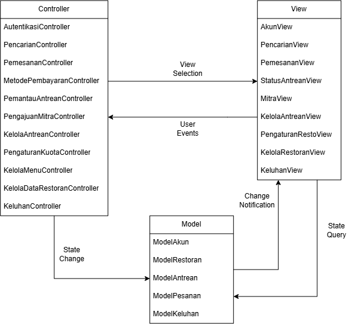

<h1>
IF2150 REKAYASA PERANGKAT LUNAK
 
TUGAS 6
 
ARSITEKTUR PERANGKAT LUNAK (APL)
</h1>
 

## *antri.in*

### Untuk: *Angel*

Dipersiapkan oleh:

| Informasi | Keterangan |
| --- | --- |
| Kelas | *01* |
| Kelompok | *10*  |
| Nama Kelompok | *Ducklings*  |

| NIM       | Nama               |
| --------- | ------------------ |
| 13525145 | Muhammad Nur Fikri Hariyawan |
| 13525085 | Bayu Palamarta Wirawan       |
| 13525133 | Chatima Anandakhorita        |
| 13525148 | Athallah Nanda Andita        |
| 13525091 | Muhammad Fauzi Muharam       |

---

 
 

# BAB 1: Style/Pattern Arsitektur Acuan

Pada bagian ini, tentukan *architectural style* atau *pattern* yang menjadi acuan untuk aplikasi yang Anda kembangkan. Misalnya *layered architecture*, *client-server*, *repository*, *pipe and filter architecture*, atau MVC (*Model-View-Controller*).

<i>Gambar 1. Contoh Arsitektur MVC</i>

Isi bab ini dengan hal-hal berikut:
1. **Style/pattern yang dipilih** beserta penjelasan singkat peran setiap bagiannya. Untuk MVC, jelaskan peran *Model*, *View*, dan *Controller*.
2. **Alasan pemilihan** berdasarkan karakteristik P/L Anda, misalnya jenis pengguna, alur proses bisnis, serta KF dan KNF pada dokumen SKPL.
3. **Gambar style/pattern yang diterapkan pada P/L Anda.** Jangan hanya menyalin Gambar 1. Isi setiap bagian pattern dengan komponen milik P/L Anda. Misalnya, kotak *Controller* berisi daftar *controller* yang ada di aplikasi dan kotak *Model* berisi daftar *model* yang ada di aplikasi.
  
Style yang dipilih adalah Architectural Style MVC. Model berperan sebagai representasi data dan aturan bisnis, View sebagai pengatur tampilan, dan Controller berperan sebagai penghubung Model dan View

Alasan Pemilihan:
1. Berdasarkan jenis pengguna:
- Pelanggan: Dengan MVC, View pelanggan dapat diperbaiki berulang kali tanpa menyentuh logika pemesanan atau pembayaran. Selain itu, informasi sensitif seperti rekening dan e-wallet hanya diakses lewat Controller, tidak langsung oleh View.
- Restoran: Karena Model menjadi sumber data tunggal, perubahan dari sisi restoran secara otomatis tersedia untuk View pelanggan tanpa menduplikasi data.
- Admin: View admin berupa panel kerja yang berbeda dari antarmuka pelanggan, sehingga bisa dikembangkan sendiri.
  
2. Berdasarkan alur proses bisnis: Data antrean yang sama muncul di HalamanStatusAntrean (pelanggan) dan DashboardAntreanPage (restoran). Dengan MVC, perubahan di Model (misalnya setelah dequeue) dapat memperbarui kedua View sekaligus.

3. Berdasarkan KF dan KNF:
- Pemisahan peran pengguna (KF21, KF15, KF19, KF20)
Sistem melayani tiga aktor (pelanggan, restoran, admin) dengan fitur yang berbeda. Dalam MVC, setiap aktor dapat dilayani oleh Controller dan View terpisah (misalnya PelangganController, RestoranController, AdminController), sementara Model tetap dipakai bersama. Hal ini mempermudah pengaturan hak akses dan alur registrasi/login/logout.

- Banyak tampilan dari data yang sama (KF01, KF02, KF03, KF13)
Data restoran, antrean, dan pesanan ditampilkan ke beberapa pihak dan di beberapa halaman. MVC memungkinkan satu Model menyediakan data yang sama untuk View yang berbeda tanpa menduplikasi logika.

- Pembaruan antrean yang saling terhubung (KF04, KF08, KF17, KF18)
Ketika restoran melakukan dequeue atau mengubah kuota, tampilan pelanggan harus ikut diperbarui. Pola Model sebagai sumber data tunggal dan View yang menyesuaikan diri terhadap perubahan Model cocok untuk menjaga sinkronisasi ini.

- Logika bisnis yang kompleks dan terpusat (KF05, KF06, KF07, KF09, KF10)
Pemeriksaan stok, dua mode pemesanan (booking dan pre-order), validasi reservasi maksimal seminggu sebelumnya, serta penyimpanan tiket antrean merupakan aturan bisnis. Dalam MVC, aturan ini ditempatkan di Model/Controller, bukan di tampilan, sehingga mudah diuji dan diubah.

- Response time (KNF02, KNF09, KNF12)
Pemisahan lapisan membuat Model dapat dioptimalkan secara mandiri tanpa memengaruhi View, sehingga target 1 detik untuk menampilkan restoran dan 10 detik untuk konfirmasi pembayaran lebih mudah dicapai.

- Reliability (KNF03, KNF06, KNF10, KNF14)
Nomor antrean unik, pencegahan pemesanan meja ganda, konfirmasi semua pembayaran, dan pencegahan double-charge adalah aturan integritas data. Dengan MVC, aturan ini dipusatkan di Model sehingga konsisten, apa pun Controller atau View yang memanggilnya.

- Security (KNF08)
Privasi nomor rekening dan e-wallet dapat dijaga dengan memastikan View tidak pernah mengakses data sensitif secara langsung. Seluruh akses melewati Controller yang melakukan otorisasi dan validasi, dan Model yang mengelola enkripsi atau penyamaran data.

- Availability (KNF01, KNF05, KNF07, KNF11)
Fitur yang harus tersedia setiap saat seperti daftar restoran, nomor antrean, dan pendaftaran dapat dipelihara dan diperbarui per komponen.

- Ergonomy (KNF04, KNF13)
Antarmuka yang minimalis dan mudah digunakan membutuhkan iterasi desain tampilan yang sering. Karena View terpisah dari logika, desain UI dapat diubah tanpa menyentuh logika bisnis.

<i>Gambar 1. Arsitektur MVC</i>

Selain *style/pattern*, tuliskan juga lingkungan operasi P/L. Tabel berikut **disalin dari subbab 2.5 *Lingkungan Operasi Perangkat Lunak* pada dokumen SKPL** tanpa perubahan. Setelah tabel, jelaskan kaitan teknologi yang dipakai dengan *style/pattern* yang dipilih. Contohnya, Django (Python) secara bawaan mengikuti pola MVT (*Model-View-Template*), yaitu varian dari MVC.

Tabel 1.1. Lingkungan Operasi Perangkat Lunak

| Komponen | Spesifikasi |
| :--- | :--- |
| *Server* | *Lokal (localhost)* |
| *Client* | *Google Chrome* |
| *DBMS* | *PostgreSQL 15+* |
| *OS* | *Windows 11* |
| *Bahasa Pemrograman* | *Typescript* |
| *API* | *REST API* |
| *...* | *...* |

<b><i>Catatan</i></b>: <i>Style/pattern yang dipilih di bab ini menjadi acuan untuk BAB 2 (pengelompokan komponen) dan BAB 3 (model arsitektur). Contoh pada dokumen ini memakai MVC secara konsisten dari BAB 1 sampai BAB 3. Kelompok boleh memakai pattern lain selama alasannya dijelaskan dan BAB 2 serta BAB 3 disesuaikan. Tabel 1.1 harus sama persis dengan subbab 2.5 dokumen SKPL; jangan menambah atau mengubah isinya karena SKPL sudah final.</i>

---

# BAB 2: Identifikasi Komponen / Modul / Subsistem

Pada bagian ini, lakukan identifikasi terhadap komponen, modul, atau subsistem yang menyusun aplikasi berdasarkan *pattern* arsitektur yang telah ditetapkan sebelumnya. Setiap komponen memiliki tanggung jawab tertentu dalam mendukung fungsionalitas sistem.

Setiap komponen memiliki tanggung jawab tertentu dalam mendukung fungsionalitas sistem secara keseluruhan. Komponen dapat dikelompokkan berdasarkan lapisan arsitektur (misalnya *Model*, *View*, dan *Controller* pada pattern MVC), atau berdasarkan fungsi atau peran komponen di dalam sistem (misalnya modul autentikasi, manajemen data, dan integrasi eksternal).

Tabel 2.1. Identifikasi Komponen/Modul/Subsistem

| Nama Komponen/Modul/Subsistem | Jenis                 | Penjelasan                                                                                                           |
| :---------------------------- | :-------------------- | :------------------------------------------------------------------------------------------------------------------- |
| *ModelAkun*                 | *Model*                | *Menyimpan identitas dan kredensial pengguna (Pelanggan, Admin), hak akses (role), serta token dan status sesi login.*     |
| *ModelRestoran*               | *Model*                | *Menyimpan profil restoran mitra, status verifikasi dan keaktifan, dokumen perizinan, daftar menu beserta stok, serta konfigurasi kuota antrean dan kapasitas meja.*                                                       |
| *ModelAntrean*                | *Model*                | *Menyimpan antrean per restoran dan tiket antrean (nomor urut, tipe dine-in/takeaway, status, estimasi waktu tunggu).*                                      |                                      |
| *ModelPesanan*           | *Model*          | *Menyimpan keranjang sementara, data pesanan (mode, jumlah rombongan, jadwal booking, total harga, status), dan riwayat transaksi pembayaran.*                                             |
| *ModelKeluhan*         | *Model*          | *Menyimpan isi, waktu kirim, dan status keluhan pelanggan.*                                          |
| *AkunView*        | *View*          | *Halaman registrasi, login, profil, dan dialog konfirmasi logout untuk Pelanggan, Restoran, dan Admin.*                |
| *PencarianView*           | *View*          | *Halaman pencarian dan filter restoran, kartu ringkasan restoran, serta pesan hasil kosong.*                                                              |
| *PemesananView*                      | *View*               | *Halaman pemilihan menu dan mode layanan (dine-in, takeaway, booking), keranjang, checkout, pembayaran, dan konfirmasi tiket antrean.*                        |
| *StatusAntreanView*                   | *View*               | *Halaman pelanggan untuk melihat status antrean secara real-time dan menerima notifikasi pengambilan pesanan.*       |
| *MitraView*                     | *View*               | *Formulir pendaftaran mitra restoran (restoran) dan halaman peninjauan pengajuan (admin).*          |
| *KelolaAntreanView*                   | *View*               | *Dashboard antrean restoran, tombol dequeue, dan dialog konfirmasi dequeue.*                                |
| *PengaturanRestoView*                    | *View*           | *Halaman restoran untuk mengatur kuota antrean, kapasitas meja, serta menu dan stok makanan.*                                                      |
| *KelolaRestoranView*       | *View* | *Halaman admin untuk melihat daftar restoran mitra dan dialog konfirmasi penghapusan restoran.* |
| *KeluhanView*                    | *View*    | *Formulir pengiriman keluhan (pelanggan) dan daftar keluhan (admin).*   |
| *AutentikasiController*                    | *Controller*    | *Registrasi akun, validasi kredensial, penerbitan token sesi, dan logout untuk semua peran.*   |
| *PencarianController*                    | *Controller*    | *Menjalankan pencarian dan filter restoran, mengambil preview menu dan status antrean.*   |
| *PemesananController*                    | *Controller*    | *Mengatur alur pemesanan: mencatat item ke keranjang, memvalidasi stok dan kuota meja, memvalidasi booking (maks. 7 hari), membuat pesanan, serta menerbitkan tiket antrean setelah pembayaran lunas.*   |
| *MetodePembayaranController*                    | *Controller*    | *Formulir pengiriman keluhan (pelanggan) dan daftar keluhan (admin).Membuat tagihan, memverifikasi status pembayaran, dan menangani timeout melalui PaymentGatewayAdapter.*   |
| *PemantauAntreanController*                    | *Controller*    | *Membaca data antrean dan mendorong pembaruan status antrean ke pelanggan secara real-time.*   |
| *PengajuanMitraController*                    | *Controller*    | *Memvalidasi dan menyimpan pengajuan mitra, serta memproses keputusan admin (setujui/tolak) dan memicu notifikasi email.*   |
| *KelolaAntreanController*                    | *Controller*    | *Menampilkan dashboard antrean, memproses dequeue manual maupun otomatis (timeout 30 menit), dan memperbarui antrean.*   |
| *PengaturanKuotaController*                    | *Controller*    | *Memvalidasi input dan menyimpan kuota antrean serta kapasitas meja, termasuk penutupan antrean sementara.*   |
| *KelolaMenuController*                    | *Controller*    | *Menambah, mengubah, menghapus menu, dan memperbarui stok.*   |
| *KelolaDataRestoranController*                    | *Controller*    | *Menonaktifkan dan menghapus data restoran beserta relasi menunya.*   |
| *KeluhanController*                    | *Controller*    | *Menerima dan menyimpan keluhan pelanggan serta menampilkan daftar keluhan kepada admin.*   |
| *PaymentGatewayAdapter*                    | *Integrasi Eksternal*    | *Penghubung ke Payment Gateway: mengirim permintaan transaksi dan menerima status lunas, gagal, atau kedaluwarsa. Penyedia dapat diganti tanpa mengubah controller.*   |
| *NotifikasiEmail*                    | *Integrasi Eksternal*    | *Mengirim email hasil verifikasi pendaftaran mitra (diterima/ditolak) melalui layanan email pihak ketiga.*   |
| *Payment Gateway*                    | *Sistem Eksternal*    | *Sistem pihak ketiga yang memvalidasi dan mengotorisasi pembayaran digital (penyedia belum ditentukan).*   |
| *Layanan Email*                    | *Sistem Eksternal*    | *Layanan pengiriman email pihak ketiga.*   |
| *BasisDataPostgreSQL*                    | *Pendukung*    | *Penyimpanan seluruh data transaksional dan operasional pada PostgreSQL 15+ di lingkungan sistem sendiri; diakses oleh seluruh komponen Model.*   |
| *...*                         | *...*                 | *...*                                                                                                                |

Ketentuan pengisian Tabel 2.1:
1. Kolom **Jenis** mengikuti pengelompokan pada *style/pattern* di BAB 1. Untuk MVC, jenisnya adalah *Model*, *View*, dan *Controller*. Jenis lain boleh ditambahkan, misalnya *Pendukung* untuk komponen bantu yang dipakai bersama, atau *Integrasi Eksternal* untuk penghubung ke sistem di luar P/L yang disebutkan pada subbab 2.2 dokumen SKPL. Kolom ini juga boleh diisi dengan *Subsistem*, *Modul*, atau *Komponen* apabila komponen dikelompokkan berdasarkan fungsinya. Tuliskan subsistem terlebih dahulu, lalu komponen penyusunnya di baris-baris berikutnya.
2. Komponen **tidak sama dengan** kelas. Satu komponen boleh mewadahi beberapa kelas dari diagram kelas pada dokumen SKPL. Pastikan seluruh kelas tercakup oleh setidaknya satu komponen.
3. Pastikan seluruh use case pada dokumen SKPL dapat dijalankan oleh komponen-komponen yang didaftarkan di tabel ini. Jangan menambahkan komponen untuk fitur yang tidak ada di SKPL.

<b><i>Catatan</i></b>: <i>Nama komponen pada Tabel 2.1 harus dipakai sama persis pada gambar di BAB 1 dan setiap view di BAB 3. Jika saat membuat view ternyata dibutuhkan komponen baru, tambahkan komponen tersebut ke Tabel 2.1 terlebih dahulu.</i>

---

# BAB 3: Model Arsitektur Perangkat Lunak

*Architectural View* adalah bagaimana cara kita melihat/mendeskripsikan arsitektur sebuah sistem dari sudut pandang tertentu. Dalam perancangan arsitektur aplikasi, dibutuhkan *Architectural View* yang dapat mempermudah pemahaman dari proses aplikasi yang akan dikembangkan. Tujuan dari *Architectural View* adalah menjadi bahan komunikasi, pemisahan masalah, mempermudah analisis, dan pemandu saat eksekusi pengembangan sistem tersebut.

Buatlah model arsitektur dari aplikasi yang akan dirancang dalam bentuk *view*. Model arsitektur ini berfungsi untuk memperlihatkan bagaimana setiap komponen, modul, dan subsistem saling berinteraksi serta berkolaborasi dalam menjalankan fungsi utama sistem secara keseluruhan. Anda dapat membuat satu atau lebih *view* tergantung kebutuhan dalam bentuk gambar. Pilihlah notasi yang sesuai. Contoh *view* yang dapat digunakan antara lain ***Logical View***, ***Process View***, ***Development View***, serta ***Physical View***.

Ketentuan pengisian BAB 3:
1. Setiap view menggambarkan **keseluruhan sistem**, bukan satu use case atau satu fitur saja.
2. Buat **minimal satu view**. Setiap view dituliskan dalam subbab tersendiri (3.1, 3.2, dan seterusnya). Tidak perlu membuat keempat view, pilih yang paling membantu menjelaskan P/L Anda, lalu jelaskan alasan pemilihannya.
3. Setiap view harus **konsisten dengan BAB 2**. Seluruh komponen pada Tabel 2.1 harus muncul dengan nama yang sama, dan tidak boleh ada komponen pada view yang tidak terdaftar di Tabel 2.1.
4. Setiap view harus **mencerminkan style/pattern pada BAB 1**. Misalnya, jika memilih MVC, pembagian *Model*, *View*, dan *Controller* harus terlihat jelas pada diagram.
5. Jika membuat lebih dari satu view, setiap view harus menggambarkan sistem yang sama dari sudut pandang berbeda. View tambahan melengkapi view pertama, bukan mengulanginya.
6. Beri label pada setiap garis atau panah yang menghubungkan komponen agar hubungan antarkomponen dapat dipahami tanpa penjelasan tambahan.
7. Jika membuat *Physical View*, gambarkan lingkungan operasi pada Tabel 1.1.

## 3.1 Logical View

Logical View dipilih karena paling jelas menunjukkan pembagian tanggung jawab antarkomponen pada pattern MVC/ECB yang dipakai antri.in View menangani antarmuka, Controller menjalankan logika bisnis, dan Model menyimpan domain data. View ini juga memperlihatkan titik integrasi dengan Payment Gateway dan layanan email, serta ketergantungan seluruh Model terhadap basis data PostgreSQL. Pembagian ini menjadi acuan implementasi dan memudahkan penelusuran dari use case ke komponen.

Arsitektur aplikasi **antri.in** dibagi menjadi beberapa lapisan utama:
1. **Layer View (Antarmuka Pengguna)**
   - Berfungsi untuk menampilkan antarmuka interaktif kepada pengguna, baik untuk pelanggan, pengelola restoran, maupun pihak mitra.
   - **Komponen**: `AkunView`, `KeluhanView`, `StatusAntreanView`, `KelolaAntreanView`, `PemesananView`, `PencarianView`, `KelolaRestoranView`, `PengaturanView`, dan `MitraView`. Setiap komponen *view* menangani fungsi spesifik seperti melihat status antrean, pemesanan menu, hingga pendaftaran mitra baru.

2. **Layer Controller (Logika Bisnis & Kendali)**
   - Menerima input dari *View*, memproses alur kerja (*use case*), dan memperbarui data pada *Model*.
   - **Komponen**: `AutentikasiController`, `KeluhanController`, `PemantauAntreanController`, `KelolaAntreanController`, `PemesananController`, `MetodePembayaranController`, `PencarianController`, `KelolaDataRestoranController`, `PengaturanKuotaController`, `KelolaMenuController`, dan `PengajuanMitraController`.

3. **Layer Model (Domain Data & Aturan Bisnis)**
   - Mengelola data utama, status aplikasi, serta transaksi bisnis.
   - **Komponen**: 
     - `ModelAkun`: Mengelola sesi dan kredensial pengguna.
     - `ModelKeluhan`: Mengelola catatan keluhan dari pengguna.
     - `ModelAntrean`: Mengelola siklus antrean, nomor tiket, dan status penerbitan antrean.
     - `ModelPesanan`: Mengelola rincian transaksi dan pesanan pelanggan.
     - `ModelRestoran`: Mengelola data restoran, stok menu, kuota meja, dan status kemitraan.

4. **Integrasi Eksternal & Layer Pendukung (Infrastructure/Persistence)**
   - **Integrasi Eksternal**:
     - `PaymentGatewayAdapter` yang terhubung ke layanan *Payment Gateway* eksternal untuk pemrosesan transaksi.
     - `NotifikasiEmail` yang terhubung ke *Layanan Email* eksternal untuk pengiriman pesan notifikasi/konfirmasi.
   - **Pendukung (Database)**: `BasisDataPostgreSQL` digunakan untuk menyimpan data relasional bagi semua model data aplikasi.

<i>Gambar 2. Logical View antri.in</i>

Gambar 2 adalah contoh *Logical View* dalam bentuk *block diagram*. Seluruh komponen pada Tabel 2.1 digambarkan dan dikelompokkan sesuai pola MVC (*View*, *Controller*, *Model*), ditambah komponen pendukung dan basis data. Sistem di luar P/L, seperti *Payment Gateway (dummy)*, digambarkan dengan garis putus-putus dan tidak perlu dimasukkan ke Tabel 2.1. Setiap garis diberi label: "Memanggil" untuk *View* yang memanggil *Controller*, "akses" untuk *Controller* yang mengakses *Model*, serta agregasi dan komposisi untuk hubungan antar-*Model*.

<b><i>Catatan</i></b>: <i>Ganti XXX dengan nama view yang dibuat, misalnya Logical View. Gambar 2 hanya contoh untuk P/L e-commerce, ganti dengan view milik kelompok Anda yang memuat seluruh komponen pada Tabel 2.1. Jenis view dan notasinya boleh berbeda dari contoh. Jika membuat view tambahan, lanjutkan pola 3.x ini (3.2, 3.3, dan seterusnya).</i>

---

# Referensi

- Sommerville, I. (2016). *Software Engineering* (10th ed.). Pearson. Chapter 6: *Architectural Design*: [https://software-engineering-book.com/slides/](https://software-engineering-book.com/slides/)
- Diagram arsitektur: [https://www.drawio.com/](https://www.drawio.com/), [https://staruml.io/](https://staruml.io/)
