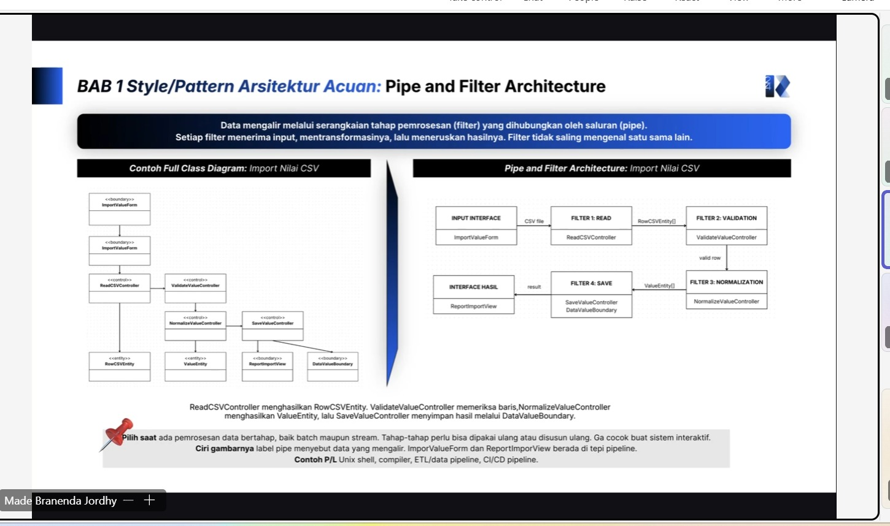

# Form Asistensi

## Tugas Besar IF2150 - Rekayasa Perangkat Lunak

| Informasi | Keterangan |
| --- | --- |
| **Hari** | *Jum'at* |
| **Tanggal** | *02/10/2026* |
| **Kelas** | *K01* |
| **Nomor Kelompok** | *G10*  |
| **Nama Kelompok** | *Ducklings*  |
| **Nama Perangkat Lunak** | *antri.in*  |
| **Dokumen** | *K01_G10_APL.md*  |

### Anggota Kelompok

| NIM | Nama |
| --- | --- |
| *13525145* | *Muhammad Nur Fikri Hariyawan* |
| *13525085* | *Bayu Palamarta Wirawan* |
| *13525133* | *Chatima Anandakhorita* |
| *13525148* | *Athallah Nanda Andita* |
| *13525091* | *Muhammad Fauzi Muharam* |

### Catatan

| Catatan |
| --- |
| 1. *Pada bab 1 minimal memilih 1 style/pattern Arsitektur acuan, jika menggunakan MVC, Model untuk pengelolaan data, View untuk informasi, Controller untuk interaksi*  |
| 2. *Tabel pada bab 2 mencakup Nama komponen, Jenis, penjelasan* |
| 3. *Bab 3 memiliki minimal 1 architecture view, setiap view tambahan menjelaskan sudut pandang berbeda dari sistem yang sama, namun harus tetap konsisten* |
| 4. *Diagram pada bab 3 spesifik menunjukkan status selama hidup, dan elemen transisi sakibat suatu operasi* |

**Notes for this section:**  
*Catatan dapat dituliskan dalam bentuk paragraf atau poin-poin, disesuaikan saja.* 

## Dokumentasi

<!--  -->

  

  <i>Gambar 1. Dokumentasi kegiatan asistensi.</i>

